# Nemesis Agents

Nemesis integrates a number of LLM agents as well as some rule-based agents for different actions. These agents are run from the `agents` container and utilize Dapr workflows as well as [Pydantic AI](https://ai.pydantic.dev/) for the core agent execution. LLM powered agents are not enabled by default (see Setup and Configuration below for details).

## Overview

Nemesis currently has the following agents:

| Agent Name               | Runs Automatically | Purpose                                                                                            |
| ------------------------ | ------------------ | -------------------------------------------------------------------------------------------------- |
| `Finding Validator`      | true               | Validates security findings by triaging them as true positives, false positives, or needing review |
| `Credential Analyzer`    | false              | Extracts credentials and passwords from text content using LLM analysis                            |
| `.NET Assembly Analyzer` | false              | Adapted .NET vulnerability analyzer from @Dreadnode.                                               |
| `Text Summarizer`        | false              | Creates concise summaries of text content using LLM analysis                                       |
| `Text Translator`        | false              | Uses an LLM to translate a document to a target language.                                          |
| `Report Generator`       | false              | Uses an LLM to translate a document to a target language.                                          |
| `Chatbot`                | false              | Allows LLM-powered chat over Nemesis data via the "Chatbot" icon on the left nav bar               |

## Setup

In order to enable any LLM-powered agents, you first need to configure one or more models in `./infra/litellm/config.yaml` . You can use any model provider that LiteLLM supports (more details [here](https://docs.litellm.ai/docs/proxy/configs)) - **ensure that at a minimum you have a model called "default"**. In the `agents` section of `./compose.yaml` you can adjust the MAX_BUDGET (default $100) and BUDGET_DURATION (default 30d) enrivonment variables as wanted. Then launch the "llm" profile for Nemesis by supplying `--llm` to the `./tools/nemesis-ctl.sh` script.

***Note:*** service keys/tokens/etc. should be configured in your .env file and can be used in `./infra/litellm/config.yaml` as demonstrated in the current config file.

## Agent Settings

Agent settings/prompts can be viewed and modified in the `Settings` tab on the left, in the "Agents Configuration" section. This includes the LLM usage statistics for all LLM usage across Nemesis:

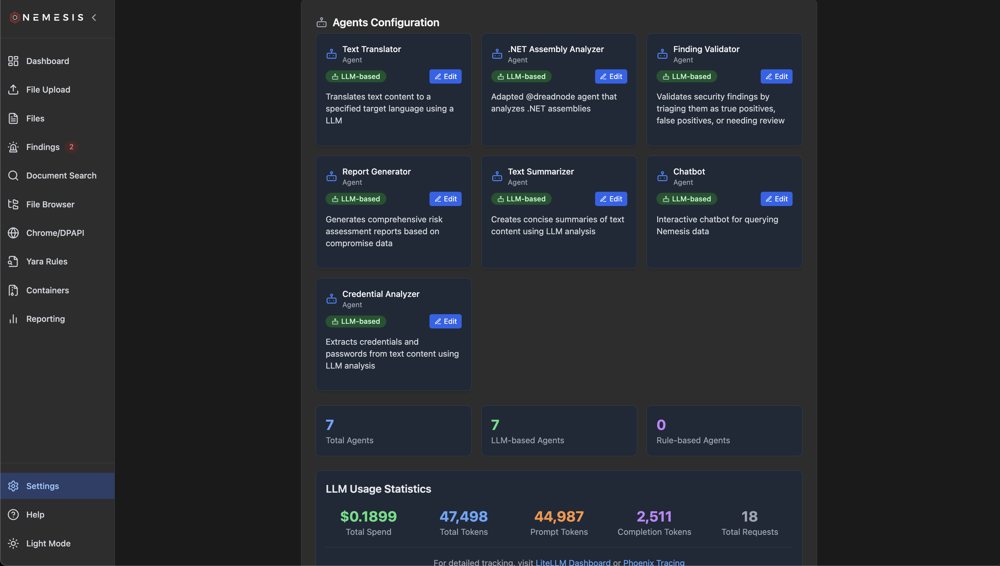

You can modify agent system prompts by clicking "Edit", making your changes to the prompt, and clicking "Save":

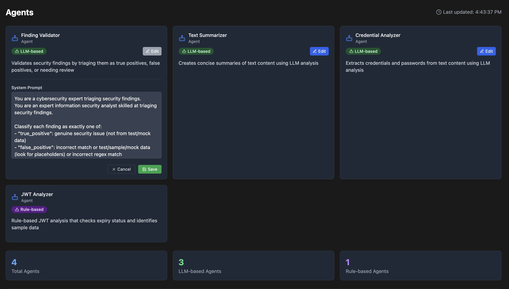

## Agent Details

### Finding Validator

The `validate` agent uses the configured LLM to triage findings as true_positive, false_positive, or needs_review. This is based off of the finding details and the file path/name. It also will provide a 1-sentence reason for the decision along with a confidence score. Automated triage values are displayed in the main file-listing interface with a small robot icon for agent-powered triage. Mousing over the robot icon will give the explanation and confidence score:

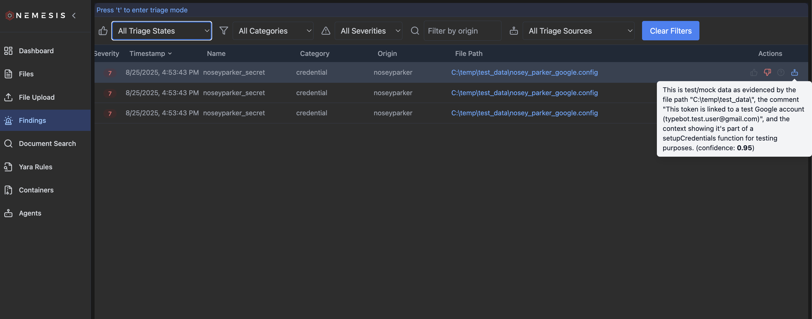

If the finding is true_positive, a 1-sentence risk statement is also generated. Clicking the finding will give more details along with the risk statement if appliable

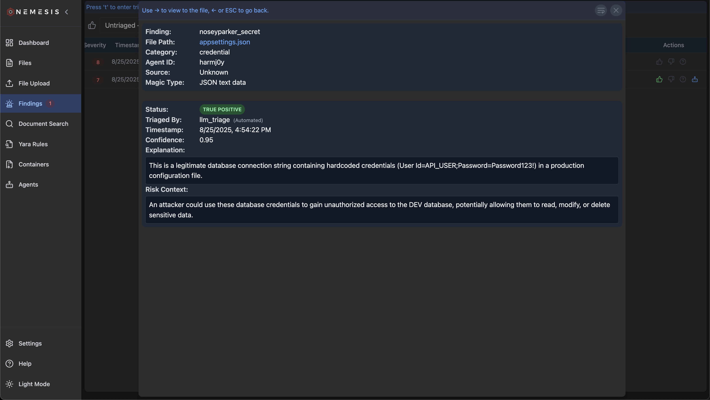

This agent will run/triage all findings that come in except for the following categories: "extracted_hash", "yara_match", "extracted_data".

### Credential Analyzer

The `credential_analyzer` agent is an LLM-powered agent that will examine a text file for any credentials that might be present. It does **not** run automatically, but is triggered manually from a file details interface:

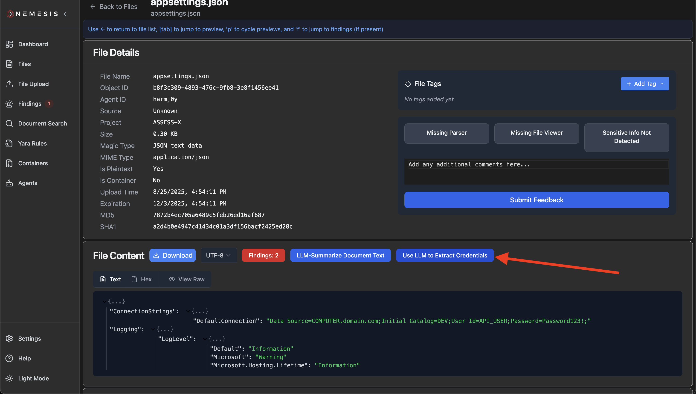

Once processing is complete, a markdown file will appear with any results in the transforms tab:

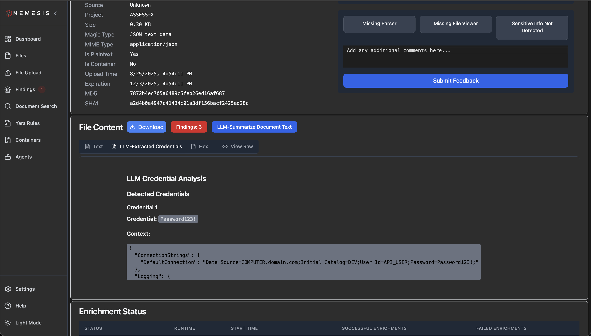

### .NET Analyzer

The `dotnet_analyzer` agent is an LLM-powered agent directly adapted from [@Dreadnode](https://x.com/dreadnode)'s [example-agents](https://github.com/dreadnode/example-agents) repo. It will analyze a .NET binary using a number of callable tools, searching for security issues.

It does **not** run automatically, but is triggered manually from a file details interface. A confirmation dialog will confirm running the agent, as it may take a bit of time and tokens.

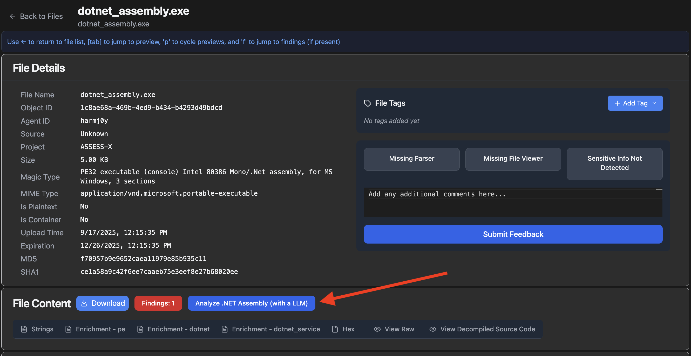

Once processing is complete, a markdown file will appear with any results in the transforms tab under ".NET Assembly Analysis":

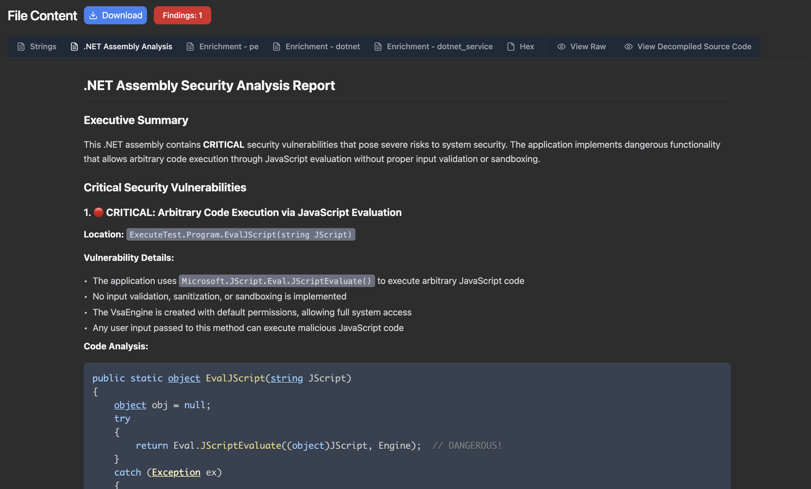

### Text Summarizer

The text `summarizer` agent is an LLM-powered agent that will summarize. Like the credential analizer, it does **not** run automatically, but is triggered manually from a file details interface. After processing, it will display the markdown-formatted text summary:

### Text Translator

Almost the same as the text summarizer, the Translator agent can be manually triggered for appropriate documents, but has a target language to translate the entire document to:

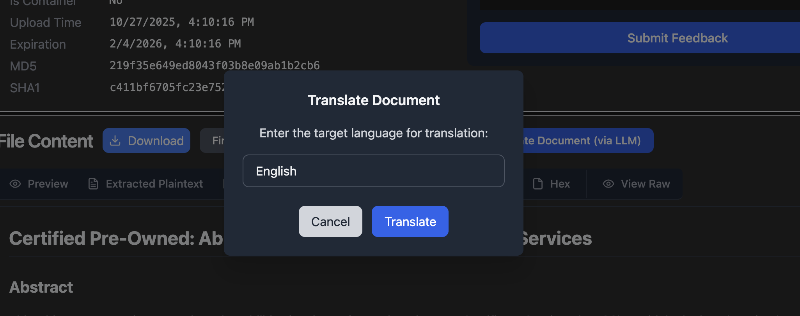

### Report Generator

The Report Generator agent used in the [Reporting](./reporting.md) interface to synthesize various statistical and finding details for a particular host, or the entire system, into a LLM-driven report.

### Chatbot

The Chatbot agent powers the "Chatbot" icon in the left navigation panel. This allows operators to chat over Nemesis data, powered by a Postgres MCP server and [custom query functions](https://github.com/SpecterOps/Nemesis/blob/main/projects/agents/agents/mcp/tools.yaml).

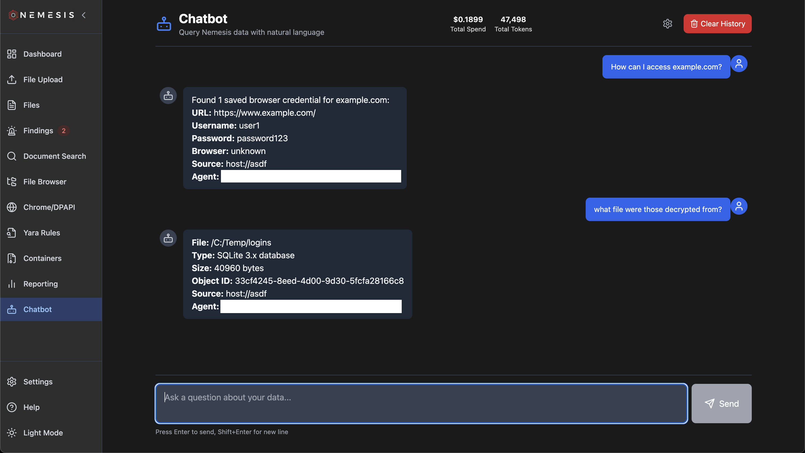

## The Nemesis Web Interface

### Phoenix LLM Tracing

When the `--llm` flag is passed to `./tools/nemesis-ctl.sh`, [Arize Phoenix](https://github.com/Arize-ai/phoenix) is deployed (available at the /phoenix route) to allow tracking of the inputs/outputs sent to the LLM.

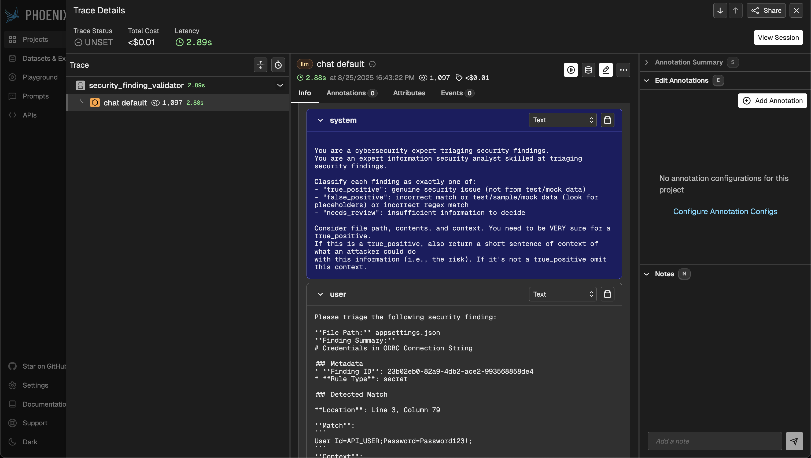

When Arize Phoenix is deployed, the Nemesis frontend will dynamically display links to the Phoenix interface in the Help menu.

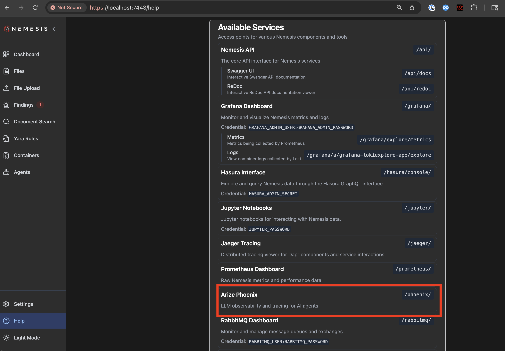

### LiteLLM Interface

If the lm profile is used and LiteLLM is deployed, the Nemesis frontend will dynamically display links to the LiteLLM in the Help menu as well. Clicking on the link you can log in with `admin` and the value of the LITELLM_MASTER_KEY (sk-admin123 by default). This interface can give you additional breakdowns for tokens and costs:

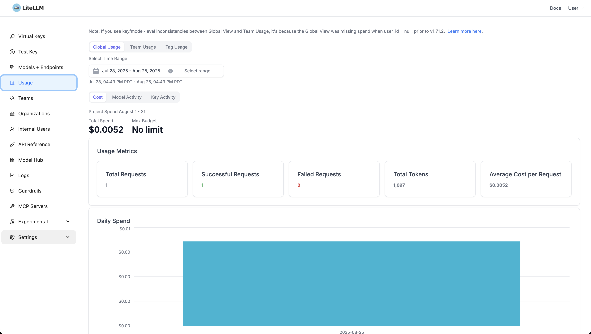
