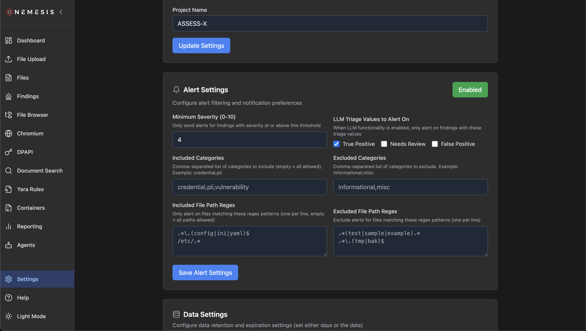

# Alerting

Nemesis has the ability to send alerts to a variety of services when findings matchig specific criteria are created.

Nemesis uses a project called [Apprise](https://github.com/caronc/apprise/) for its alerting engine. See the [Apprise Wiki](https://github.com/caronc/apprise/wiki) for the string format needed for each alerting service.

## Enabling Alerting

In order to enable alerting, set one or more Apprise compatible URLs to the `APPRISE_URLS` ENV variable (comma-separated for multiple URLs) before launching Nemesis. Once set, alerts on "interesting" files (e.g., parsed credentials, Nosey Parker hits, DPAPI data discovery, etc.) will be pushed to the configuered Slack webhook/channel with **Nemesis** as the bot user. These messages will contain the alert name, alert category, any additional details, a sanitized file path and a link to the [file details](usage_guide.md#file-details) and finding details in the dashboard:

### User Feedback

Apprise allows you to route different messages to different services via a tagging system. If you want user feedback from the [File Details viewer](usage_guide.md#file-details) to be routed for alerting, use an Apprise link with a `feedback` tag (e.g., `slack://Nemesis@T...k/#nemesis-feedback?tag=feedback`) - this will route user feedback actions to that specified channel, with regular alerts going to any configured channel without the feedback tag.

You can configure multiple Apprise URLs for alerting and user feedback (i.e., alerting to multiple services).

## Alerting Configuration

False positives are a fact of life, and types of files on your operation may create a large number of false positives. In order to help with this, Nemesis' alerting system can be dynamically configured after Nemesis is deployed via the **Settings** page on the left navigation bar:

Here alerting can be enabled/disabled, and specific filters can be used to only allow alerts with specific criteria to be delivered.

If [LLM Agents](./agents.md) are enabled, the **LLM Triage Values to Alert On** will allow you to filter on whether findings were true positives or not.