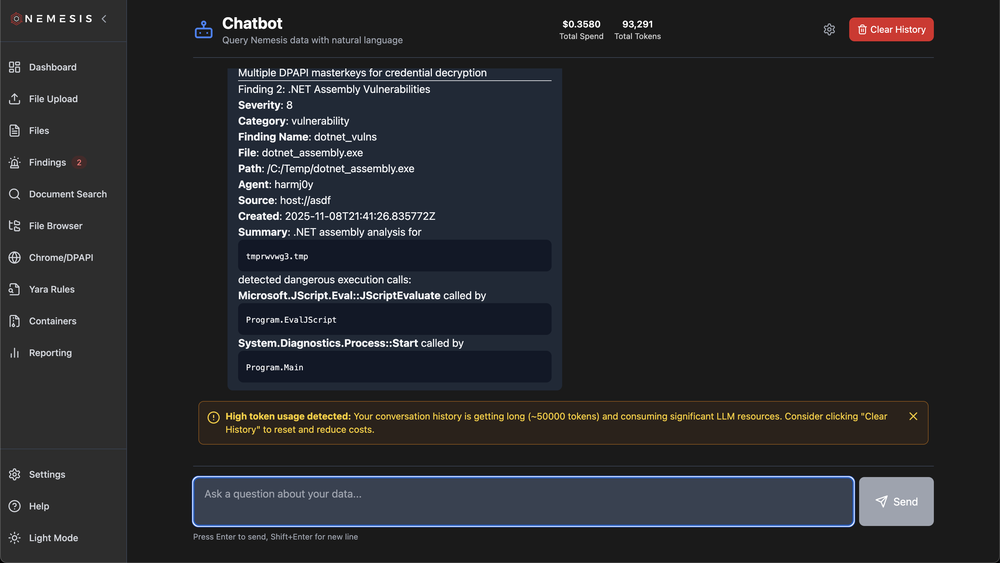
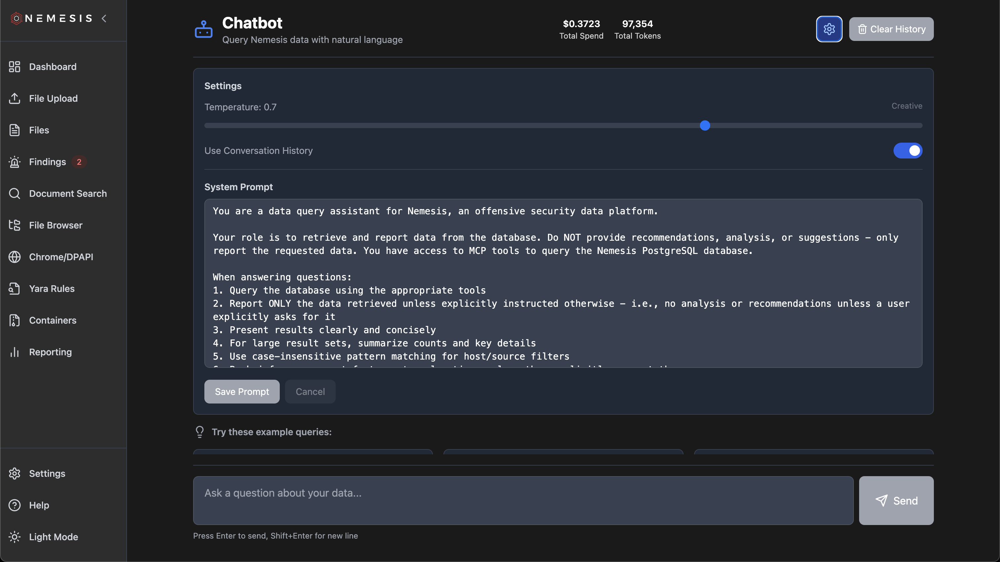

# Nemesis Chatbot

The `Chatbot` icon on the left navigation bar is dynamically enabled when the `--llm` profile is used.

## Usage

In order to use the Chatbot, see [agents.md](./agents.md) on configuring LLM functionionality.

Once enabled, the Chatbot interface allows operators to chat over Nemesis data, powered by a Postgres MCP server and [custom query functions](https://github.com/SpecterOps/Nemesis/blob/main/projects/agents/agents/mcp/tools.yaml).


History is automatically preserved and used when conversing with the chatbot - this will increase the number of tokens (tracked at the top of the page along with cost) used but allow for multi-turn conversations. You can clear the history with the "Clear History" button - a warning will also show when the conversation passes 50k tokens:



## Settings

The Settings gear icon at the top of the page allows you to modify the temperature, system prompt, and/or whether to use the conversation history:



## MCP

Additionally, the MCP used by the Chatbot is exposed over the `/mcp` route in the main Nemesis interface. For demonstration purposes, a bridge is at [./tools/mcp_bridge.py](https://github.com/SpecterOps/Nemesis/blob/main/tools/mcp_bridge.py) and can be used with Claude Desktop with the following config:

```json
{
  "mcpServers": {
    "nemesis": {
      "command": "python3",
      "args": ["/Users/User/path/to/Nemesis/tools/mcp_bridge.py"]
    }
  }
}
```

**Note:** modify the credentials in the [./tools/mcp_bridge.py](https://github.com/SpecterOps/Nemesis/blob/main/tools/mcp_bridge.py) file to match your credentials!
