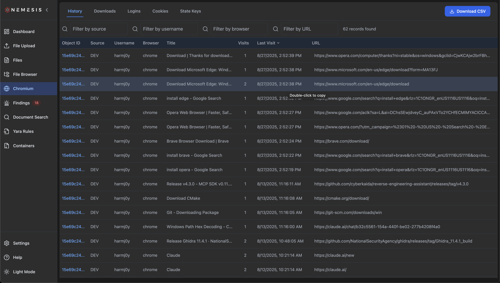
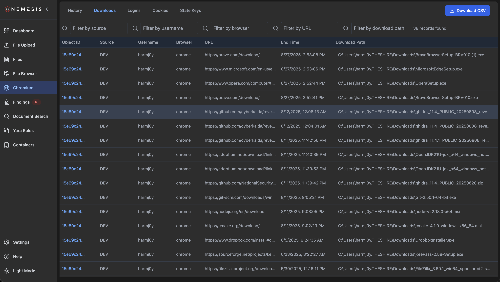
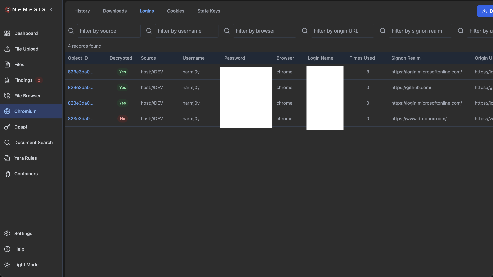
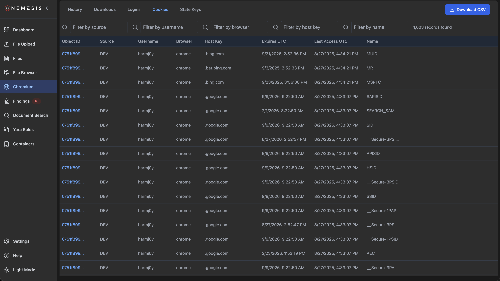
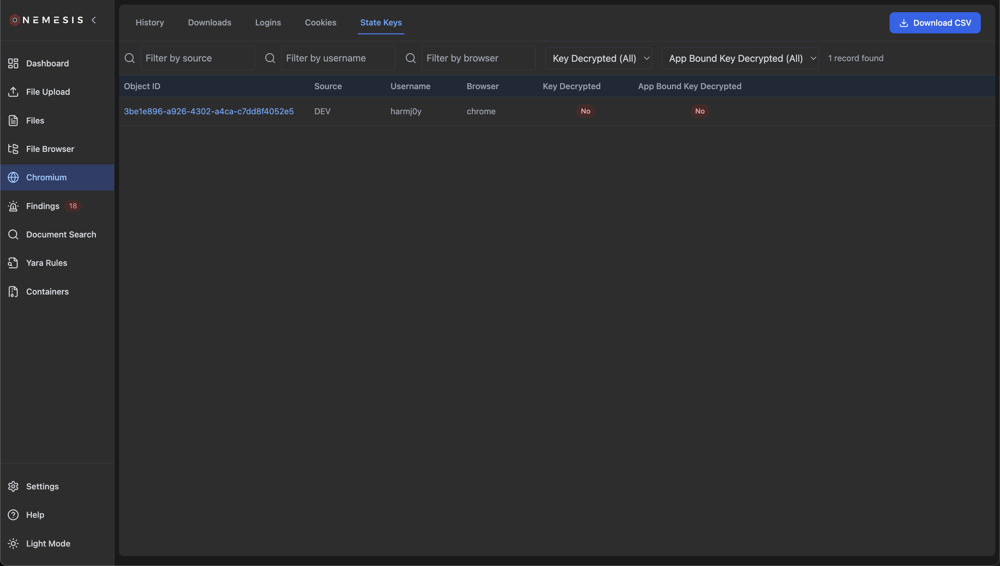

# Nemesis Chromium Analysis

Nemesis includes comprehensive support for analyzing Chromium-based browser data including Chrome, Edge, Brave, and other Chromium-based browsers. The system automatically detects and processes various Chromium database files to extract browsing history, saved credentials, cookies, downloads, and encryption state information.

## Overview

Nemesis currently analyzes the following Chromium data sources:

| Data Type  | File Source   | Purpose                                                                        |
| ---------- | ------------- | ------------------------------------------------------------------------------ |
| History    | `History`     | Extracts browsing history including URLs, titles, visit counts, and timestamps |
| Downloads  | `History`     | Extracts download history with file paths, URLs, and download metadata         |
| Logins     | `Login Data`  | Extracts saved login credentials including usernames and passwords             |
| Cookies    | `Cookies`     | Extracts browser cookies with domain, name, value, and expiration data         |
| State Keys | `Local State` | Extracts OS encryption keys used to decrypt passwords and sensitive data       |

## Chrome Web Tab

### Chromium Data Viewer

The Nemesis frontend provides a dedicated Chromium interface accessible through the main navigation. This interface organizes all extracted Chromium data into five main categories:

### History Tab

The History tab displays extracted browsing history with searchable and filterable tables. Each entry includes:

- **Object ID**: The object_id from the originating file
- **Source**: the "source" label for the originating file (host, url, etc.)
- **Username**: Host-based username, extracted from file path context (i.e., `C:\Users\USER\*`)
- **Browser**: Browser name, extracted from file path context
- **Title**: Page title as recorded by the browser
- **Visits**: Number of times the URL was visited
- **Last Visit**: Timestamp of most recent visit
- **URL**: The visited website URL

### Downloads Tab

The Downloads tab shows extracted download history with detailed information about each downloaded file:

- **Object ID**: The object_id from the originating file
- **Source**: the "source" label for the originating file (host, url, etc.)
- **Username**: Host-based username, extracted from file path context (i.e., `C:\Users\USER\*`)
- **Browser**: Browser name, extracted from file path context
- **URL**: Original source URL of the downloaded file
- **End Time**: Time the download ended
- **Download Path**: Path the file was downloaded to on the host

### Logins Tab

The Logins tab displays extracted login credentials:

- **Object ID**: The object_id from the originating file
- **Decrypted**: Yes/No indication if the login entry has been decrypted (by a state key) or not
- **Source**: the "source" label for the originating file (host, url, etc.)
- **Username**: Host-based username, extracted from file path context (i.e., `C:\Users\USER\*`)
- **Password**: Plaintext value of the password (if decrypted)
- **Browser**: Browser name, extracted from file path context
- **Login Name**: Extracted login name for the login data entry (NOT the host-based path username of the Login Data file)
- **Times Used**: Number of times the login entry has been used
- **Signon Realm**: Extracted signon realm for the login entry
- **Origin URL**: Website where credentials were saved

### Cookies Tab

The Cookies tab provides access to extracted browser cookies:

- **Object ID**: The object_id from the originating file
- **Decrypted**: Yes/No indication if the coookie has been decrypted (by a state key) or not
- **Source**: the "source" label for the originating file (host, url, etc.)
- **Username**: Host-based username, extracted from file path context (i.e., `C:\Users\USER\*`)
- **Password**: Plaintext value of the password (if decrypted)
- **Browser**: Browser name, extracted from file path context
- **Host Key**: Domain or host the cookie belongs to
- **Expires UTC**: Time (in UTC) the cookie value expires
- **Last Access UTC**: Time (in UTC) the cookie value was last uased
- **Name**: Name identifier of the cookie

**Note**: If the cookie value has been decrypted, click "Download CSV" to download the currently filtered/viewable
cookies on the page *including* decrypted values.

### State Keys Tab

The State Keys tab displays OS encryption keys used by Chromium to protect sensitive data:

- **Object ID**: The object_id from the originating file
- **Source**: the "source" label for the originating file (host, url, etc.)
- **Username**: Host-based username, extracted from file path context (i.e., `C:\Users\USER\*`)
- **Browser**: Browser name, extracted from file path context
- **Key Decrypted**: If the pre-v127 Chromium local state encryption key has been decrypted
- **App Bound Key Decrypted**: If the post-v127 Chromium App-bound encryption key has been decrypted

## Data Export and Analysis

### CSV Export Functionality

All Chromium data tables support CSV export for external analysis:

1. Use the table interface to filter and search desired records
2. Click the "Download CSV" button in the top-right of each tab
3. All currently visible/filtered records will be exported

### Copy Operations

Individual records or entire result sets can be copied to clipboard:

- **Single Row**: Double-click any table row to copy all fields
- **Multiple Rows**: Select rows and use Ctrl+C (or Cmd+C on Mac)
- **Filtered Results**: Copy button will copy all currently visible records
