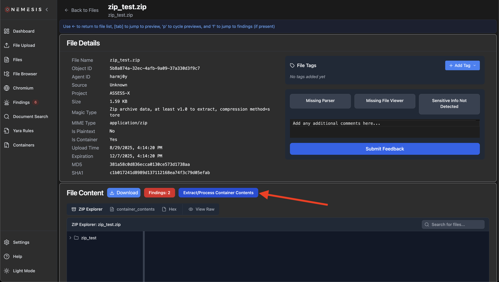
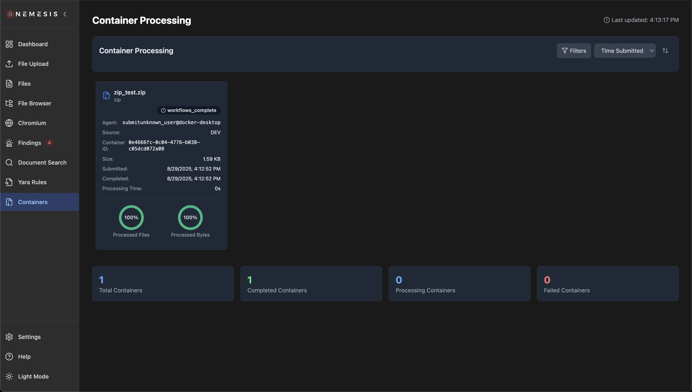

# Containers

Nemesis has the ability to process the files extracted/carved from various container formats _without_ saving the container itself to the internal datalake. This is useful in the following situations:

- When you want to process a large number of files without doubling the storage (storing .zip + extracted files)
- When you want to process large "containers" like forensic disk images

## Supported Container Formats

### ZIP Archives

Standard `.zip` files. Nemesis detects these by file extension or by inspecting file content (falling back to content detection for unknown extensions).

### Disk Images

Disk images are parsed using [The Sleuth Kit](https://www.sleuthkit.org/sleuthkit/) (via [pytsk3](https://pypi.org/project/pytsk3/)), which supports a wide range of forensic image formats, filesystems, and partition schemes.

**Supported image formats:**

| Extension(s) | Format |
|---|---|
| `.dd`, `.raw`, `.img`, `.image`, `.bin` | Raw disk images |
| `.dmg` | macOS disk images |
| `.e01`, `.ex01` | EnCase / Expert Witness Format |
| `.l01`, `.lx01` | EnCase Logical Evidence |
| `.ewf` | Expert Witness Format (generic) |
| `.s01` | Segmented EnCase images |

The Sleuth Kit also supports **VHD**, **VMDK**, and **AFF** image formats, though Nemesis currently only auto-detects the extensions listed above. Files with other extensions will fall back to ZIP content detection.

**Supported filesystems within disk images:**

NTFS, FAT (FAT12/FAT16/FAT32), ExFAT, EXT2, EXT3, EXT4, HFS, APFS, UFS 1, UFS 2, ISO 9660, and YAFFS2.

**Supported partition/volume schemes:**

DOS/MBR partitions, GPT disks, BSD disk labels, Mac partitions, and Sun VTOC (Volume Table of Contents).

## Submitting Containers

### "Regular" Containers

To process a regular container, you have two options. First, you can submit the .zip/etc. as normal, and then click "Extract/Process Container Contents" on the file viewer page:



Alternatively, you can configure and drop containers into the mounted folder as described in the **"Large" Containers** section below.

You can also submit the container with the `nemesis-cli` (and `./tools/submit.sh` script) with something like (note the --container flag):

```bash
% ./tools/submit.sh --project PROJECT-123 --source DEV --container zip_test.zip
Uploading (✓:1 ✗:0 | 1.59 KB): 100%|██████████| 1/1 [00:00<00:00]
INFO
Upload Summary:
INFO     ────────────────────────────────────────
INFO     Total Files:     1
INFO     Successful:      1
INFO     Failed:          0
INFO     Success Rate:    100.0%
INFO     Total Uploaded:  1.59 KB
```

### "Large" Containers

For large things like disk images, a straight REST API doesn't cut it - lots of things mess up. Getting a multi-gigabyte file into Nemesis can be a challenge, but the current process uses a mountained container and large container monitoring abilities in the `web-api` service.

In order to process really large containers, first create a folder on your host and set the MOUNTED_CONTAINER_PATH ENV variable to that path. This folder is mounted into the `web-api` and will process containers that appear there (after they're done copying in). Then just start Nemesis and copy containers into that folder, it's that easy!

Wait, but what about metadata?

#### Large Container Configs/Metadata

Since we're changing the normal way we submit files, we need a new way to pass metadata into Nemesis for a disk image/large container. In order to accomplish this, we support a YAML-based metadata file format that can be placed in the parent folder, or any sub folders. This file can be named config.[yaml|yml] or settings.[yaml|yml] and takes the form:

```yaml
metadata:
  project: project123
  agent: collector
  source: BLAH
file_filters:
  pattern_type: regex
  include:
    - "^(?:[A-Za-z]://|/)?[Ww]indows/[Ss]ystem32/config/"
  exclude:
    - "^(?:[A-Za-z]://|/)?[Ww]indows/"
```

The metadata will be passed through for every file carved from the container. The optional `file_filters` allow you specify which extracted/carved files to include, or not include, for processing.

The logic for inclusion varies based on which patterns are provided:

1. No filters: Include everything
2. Only include patterns: Only include files matching include patterns (allowlist mode)
3. Only exclude patterns: Include everything except files matching exclude patterns (blocklist mode)
4. Both include and exclude: Include everything, apply excludes, then re-include matches from include patterns (exception mode)

This creates a natural hierarchy where include patterns act as exceptions to exclusions when both are present.

You can also create sub-directories in the submission folder, for example:

```
MOUNTED_CONTAINER_PATH  /   settings.yaml
                        /   disk1.dd
                        /   windows /
                                    / settings.yaml
                                    / windows_disk.dd
```

In this case, the `settings.yaml` closest to the hierarchy of the file takes precedence - the "windows_disk.dd" will use the settings.yaml in its current folder, but would use the MOUNTED_CONTAINER_PATH/settings.yaml file if one wasn't present lower down. This lets you create a nested structure with multiple config options depending on where you drop your disk image.


## Tracking Containers

Whether a container is submitted via the cli or the mounted folder option, it will appear in the "Containers" page accessible from the left navigation page:



This page will show the status of the container file extraction, and lets you filter by various fields.