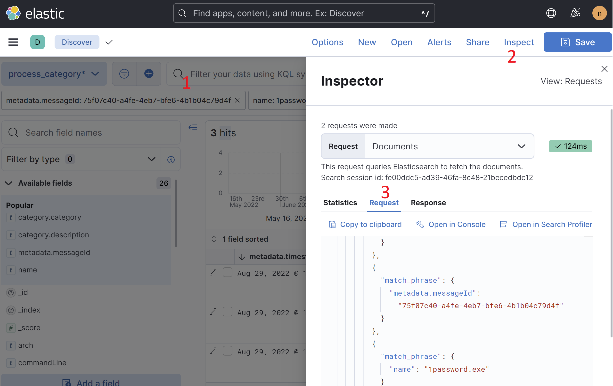

# Infra
Elastic is deployed using [the Elastic operator and is installed via helm](https://www.elastic.co/guide/en/cloud-on-k8s/master/k8s-install-helm.html). The operator runs inside the `elastic-system` namespace and its logs can be viewed with the following command:
```bash
kubectl logs -n elastic-system sts/elastic-operator
```

The custom resource definitions that the helm chart installs can all be found [here](https://github.com/elastic/cloud-on-k8s/tree/2.3/config/samples). The helm chart can be found [here](https://github.com/elastic/cloud-on-k8s/tree/main/deploy).

# Storage

By default this Elasticsearch instance uses a persistent data store. The size of the datastore can be adjusted in the [values.yaml](https://github.com/SpecterOps/Nemesis/blob/main/helm/nemesis/values.yaml) file by modifying the `storage: 20Gi` in the `elasticsearch` config section.

To use temporary storage that is wiped on every run, set "environment" to "test" at the top of [values.yaml](https://github.com/SpecterOps/Nemesis/blob/main/helm/nemesis/values.yaml).

# Accessing Elastic/Kibana
To login to Elastic or Kibana, run `./scripts/get_service_credentials.sh` to get the basic auth credentials.

Example to confirm elastic is working:
```bash
export BASIC_AUTH_USER=$(kubectl get secret basic-auth -o jsonpath="{.data.username}" | base64 -d)
export BASIC_AUTH_PASSWORD=$(kubectl get secret basic-auth -o jsonpath="{.data.password}" | base64 -d)
curl -k -u "$BASIC_AUTH_USER:$BASIC_AUTH_PASSWORD" "https://localhost:8080/elastic/"
```

# Troubleshooting
## Helm can't install the elastic operator
See https://github.com/elastic/cloud-on-k8s/issues/5325#issuecomment-1124682097. Confirmed that fix worked, as did upgrading minikube to at least v1.26.1

## Elastic endpoints for troubleshooting

- Any issues with cluster allocation:
  - https://localhost:8080/elastic/_cluster/allocation/explain
- Indicies/shard health:
  - https://localhost:8080/elastic/_cat/indices?v&health=yellow
  - https://localhost:8080/elastic/_cat/shards?v
- Drive space:
  - https://localhost:8080/elastic/_cat/allocation?v
- CPU utilization/etc:
  - https://localhost:8080/elastic/_cat/nodes?v

By default, Elastic will not allocate additional shard if 90%+ of the hard disk in the pod is allocated. If Minikube fills up, the drive space will be reflected as also filled in the Elastic container. This causes Kibana to fail in object creation, and Kibana will be stuck in a non-functional startup look. The solution is to ssh into minikube with `minikube ssh` and then run `docker system prune` to free up resources.

# Example queries:
An "easy" way to build elastic search queries is to do the search in Kibana's "Discover" page, click the "Inspect" button in the top right, and click on "Request":



## 1 - Simple search via query string for a process name and message GUID:
```
curl -k -u nemesis:Qwerty12345 -XGET 'https://192.168.230.52:8080/elastic/process_category/_search?q=name:explorer.exe%20AND%20metadata.messageId:75f07c40-a4fe-4eb7-bfe6-4b1b04c79d4f&pretty'
```

More info about the query string syntax [here](https://www.elastic.co/guide/en/elasticsearch/reference/current/query-dsl-query-string-query.html#query-string-syntax).


## Same search as above, but only returning the name/category fields
```bash
curl -k -X POST -u nemesis:Qwerty12345 -H 'Content-Type: application/json' 'https://192.168.230.52:8080/elastic/process_category/_search?pretty' -d '
{
    "_source": {
        "includes": [ "name", "category.*" ]
    },
    "query": {
        "bool": {
            "filter": [
              {
                "match_phrase": {
                  "metadata.messageId": "75f07c40-a4fe-4eb7-bfe6-4b1b04c79d4f"
                }
              },
              {
                "match_phrase": {
                  "name": "1password.exe"
                }
              }
            ]
        }
    }
  }
'
```

# Backup and Restore Data
**Use case:** If the minikube node ever needs to be deleted (e.g., something goes wrong to start fresh or you're done with an op) and you want to backup Elastic's data.

**Backup**
1. Ensure Nemesis's Elastic DB or minikube is stopped: `minikube stop` or `kubectl delete nemesis-es-default-0`.

2. Copy the ES's files to somewhere else:
```
cp -r /var/lib/docker/volumes/minikube/_data/data/elastic /tmp/esbackup`
```
3. Now the backup is saved somewhere else, so feel free to delete the minikube node: `minikube delete`.

**Restore**
1. Start minikube: `minikube start`

2. Copy the backup files back and set the appropriate permissions:
```
sudo cp -r /tmp/esbackup /var/lib/docker/volumes/minikube/_data/data/elastic

sudo find /var/lib/docker/volumes/minikube/_data/data/elastic -type d -exec chmod 777 {} \;
sudo find /var/lib/docker/volumes/minikube/_data/data/elastic -type f -exec chmod 666 {} \;
```

3. Startup Nemesis
