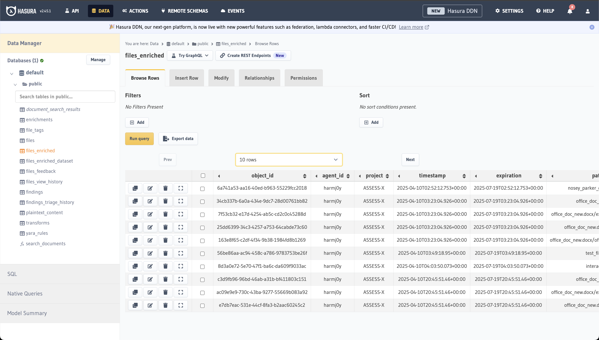

# Hasura

Nemesis uses Hasura to wrap the PostgreSQL backend to easily build a GraphQL and REST API for the structure Nemesis data model.

Navigating to the "Help" menu reachable in the bottom left of the Nemesis interface and clicking the `/hasura/console/` route link will take you to the Hasura login. Enter the value of the `HASURA_ADMIN_SECRET` ENV variable to login.

## Console

The Hasura console allows you to explore the pre-configured backend data schema, which allows you to explore the schema and query data:


***Note:*** There is a [quickstart to Hasura queries here](https://hasura.io/docs/latest/queries/quickstart/).

The "Data" tab on top allows you to query the database in a more traditional manner:



## Scripting

Hasura allows for _external_ queries and subscriptions to the backend schema, very similar to Mythic:

### Queries

Here is an example of performing a basic query against the Hasura Nemesis endpoint:

```python
from base64 import b64encode
from gql import Client, gql
from gql.transport.aiohttp import AIOHTTPTransport
from gql.transport.websockets import WebsocketsTransport
from pprint import pprint
import ssl

HASURA_ENDPOINT = "https://localhost:7443/hasura/v1/graphql"
BASIC_AUTH_USERNAME = "n"
BASIC_AUTH_PASSWORD = "n"
ssl_context = ssl.create_default_context()
ssl_context.check_hostname = False
ssl_context.verify_mode = ssl.CERT_NONE

def basic_auth(username, password):
    token = b64encode(f"{username}:{password}".encode('utf-8')).decode("ascii")
    return f'Basic {token}'

transport = AIOHTTPTransport(
    url=HASURA_ENDPOINT,
    headers={'Authorization': basic_auth(BASIC_AUTH_USERNAME, BASIC_AUTH_PASSWORD)},
    ssl=ssl_context
)

client = Client(transport=transport, fetch_schema_from_transport=True)

query = gql(
    """
query MyQuery {
  files_enriched {
    path
    magic_type
    hashes
    size
  }
}
"""
)

results = client.execute(query)

pprint(results["files_enriched"])
```

### Subscriptions

***TODO***