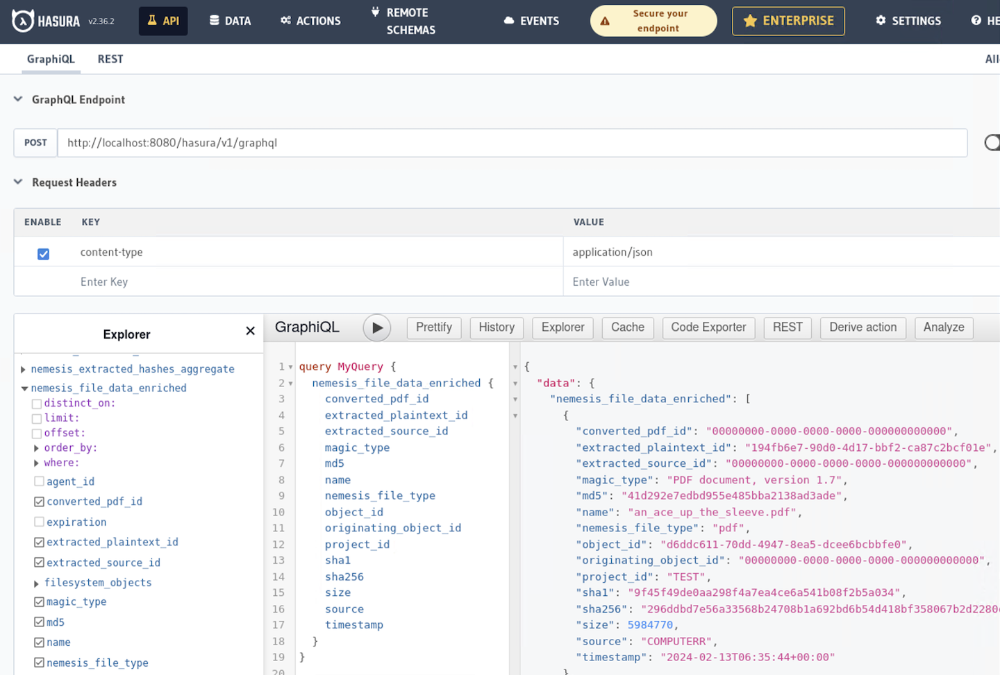

# Overview

Nemesis uses Hasura to wrap the PostgreSQL backend to easily build a GraphQL and REST API for the structure Nemesis data model.

The route exposed is `/hasura/` and there are no additional credentials beyond the common basic auth.

## Console

The Hasura console allows you to explore the pre-configured backend data schema:



There is a [quickstart to Hasura queries here](https://hasura.io/docs/latest/queries/quickstart/).

## Scripting

Hasura allows for _external_ queries and subscriptions to the backend schema, very similar to Mythic (in fact, this is what we do for the [Mythic Connector](https://github.com/SpecterOps/Nemesis/tree/main/cmd/connectors/mythic-connector#readme)!)

### Queries

Here is an example of performing a basic query against the Hasura Nemesis endpoint:

```python
from base64 import b64encode
from gql import Client, gql
from gql.transport.aiohttp import AIOHTTPTransport
from gql.transport.websockets import WebsocketsTransport
from pprint import pprint
import ssl

HASURA_ENDPOINT = "https://localhost:8080/hasura/v1/graphql"
BASIC_AUTH_USERNAME = "nemesis"
BASIC_AUTH_PASSWORD = "Qwerty12345"
ssl_context = ssl.create_default_context()
ssl_context.check_hostname = False
ssl_context.verify_mode = ssl.CERT_NONE

def basic_auth(username, password):
    token = b64encode(f"{username}:{password}".encode('utf-8')).decode("ascii")
    return f'Basic {token}'

transport = AIOHTTPTransport(
    url=HASURA_ENDPOINT,
    headers={'Authorization': basic_auth(BASIC_AUTH_USERNAME, BASIC_AUTH_PASSWORD)},
    ssl=ssl_context
)

client = Client(transport=transport, fetch_schema_from_transport=True)

query = gql(
    """
query MyQuery {
  nemesis_file_data_enriched {
    path
    sha256
    magic_type
  }
}

"""
)

results = client.execute(query)

pprint(results["nemesis_file_data_enriched"])
```

### Subscriptions

Here is an example of performing a subscription that returns files with extracted plaintext as they come in, querying the Elasticsearch endpoint for the actual indexed text:

```python
from base64 import b64encode
from pprint import pprint
import urllib3
import time
import datetime
import ssl
from gql import Client, gql
from gql.transport.aiohttp import AIOHTTPTransport
from gql.transport.websockets import WebsocketsTransport
from elasticsearch import Elasticsearch


HASURA_WEBSOCKET_ENDPOINT = "wss://localhost:8080/hasura/v1/graphql"
BASIC_AUTH_USERNAME = "nemesis"
BASIC_AUTH_PASSWORD = "Qwerty12345"
ELASTICSEARCH_URL = "https://localhost:8080/elastic/"
WAIT_TIMEOUT = 5
ssl_context = ssl.create_default_context()
ssl_context.check_hostname = False
ssl_context.verify_mode = ssl.CERT_NONE
urllib3.disable_warnings()


def basic_auth(username, password):
    token = b64encode(f"{username}:{password}".encode('utf-8')).decode("ascii")
    return f'Basic {token}'

def elastic_plaintext_search(object_id: str) -> dict:
    """
    Searches the 'file_data_enriched' index in Elasticsearch for
    the matching document, returning all fields.
    """
    try:
        es_client = wait_for_elasticsearch()
        query = {"term": {"objectId.keyword": object_id}}
        results = es_client.search(index="file_data_plaintext", query=query)
        return results["hits"]["hits"][0]["_source"]["text"]
    except Exception as e:
        if "index_not_found_exception" in f"{e}":
            return {"error": "Elastic index 'file_data_plaintext' doesn't yet exist!"}
        else:
            return {"error": f"Exception querying Elastic: {e}"}

def wait_for_elasticsearch():
    """
    Wait for a connection to be established with Nemesis' Elasticsearch container,
    and return the es_client object when a connection is established.
    """

    while True:
        try:
            es_client = Elasticsearch(
                ELASTICSEARCH_URL,
                basic_auth=(BASIC_AUTH_USERNAME, BASIC_AUTH_PASSWORD),
                verify_certs=False,
                ssl_show_warn=False,
                ssl_context=ssl_context
            )
            es_client.info()
            return es_client
        except Exception:
            print(
                "Encountered an exception while trying to connect to Elasticsearch %s, trying again in %s seconds...",
                ELASTICSEARCH_URL,
                WAIT_TIMEOUT,
            )
            time.sleep(WAIT_TIMEOUT)
            continue


transport = WebsocketsTransport(
    url=HASURA_WEBSOCKET_ENDPOINT,
    headers={'Authorization': basic_auth(BASIC_AUTH_USERNAME, BASIC_AUTH_PASSWORD)},
    ssl=ssl_context
)

client = Client(
    transport=transport,
    fetch_schema_from_transport=True,
)

# subscription for any enriched files that had plaintext extracted
plaintext_subscription = gql('''
subscription PlaintextSubscription {
  nemesis_file_data_enriched(where: {extracted_plaintext_id: {_neq: "00000000-0000-0000-0000-000000000000"}}) {
    path
    sha256
    magic_type
    extracted_plaintext_id
  }
}
''')

print(f"[{datetime.datetime.now().isoformat()}] Starting Nemesis subscription...")
for results in client.subscribe(plaintext_subscription):
    if results and len(results["nemesis_file_data_enriched"]) > 0:
        for result in results["nemesis_file_data_enriched"]:
            path = result["path"]
            print(f"path: {path}")
            # retrieve the actual plaintext from Elastic
            text = elastic_plaintext_search(result["extracted_plaintext_id"])
            # ... do stuffz

```
