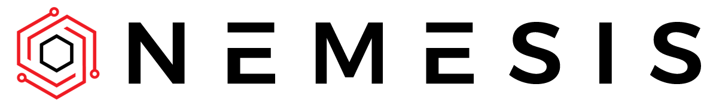

    

# Overview

Nemesis is an offensive data enrichment pipeline and operator support system.

Built on Kubernetes with scale in mind, our goal with Nemesis was to create a centralized data processing platform that ingests data produced during offensive security assessments.

Nemesis aims to automate a number of repetitive tasks operators encounter on engagements, empower operators’ analytic capabilities and collective knowledge, and create structured and unstructured data stores of as much operational data as possible to help guide future research and facilitate offensive data analysis.

# Setup / Installation
See the [setup instructions](setup.md).

# Usage
See the [Nemesis Usage Guide](usage_guide.md).

# Contributing / Development Environment Setup
See [development.md](development.md)

## Further Reading

| Post Name                                   | Publication Date | Link                                                                               |
|---------------------------------------------|------------------|------------------------------------------------------------------------------------|
| *Shadow Wizard Registry Gang: Structured Registry Querying* | Sep 5, 2023 | https://posts.specterops.io/shadow-wizard-registry-gang-structured-registry-querying-9a2fab62a26f |
| *Hacking With Your Nemesis*                 | Aug 9, 2023      | https://posts.specterops.io/hacking-with-your-nemesis-7861f75fcab4                 |
| *Challenges In Post-Exploitation Workflows* | Aug 2, 2023      | https://posts.specterops.io/challenges-in-post-exploitation-workflows-2b3469810fe9 |
| *On (Structured) Data*                      | Jul 26, 2023     | https://posts.specterops.io/on-structured-data-707b7d9876c6                        |

# Acknowledgments

Nemesis is built on large chunk of other people's work. Throughout the codebase we've provided citations, references, and applicable licenses for anything used or adapted from public sources. If we're forgotten proper credit anywhere, please let us know or submit a pull request!

We also want to acknowledge Evan McBroom, Hope Walker, and Carlo Alcantara from SpecterOps for their help with the initial Nemesis concept and amazing feedback throughout the development process.
