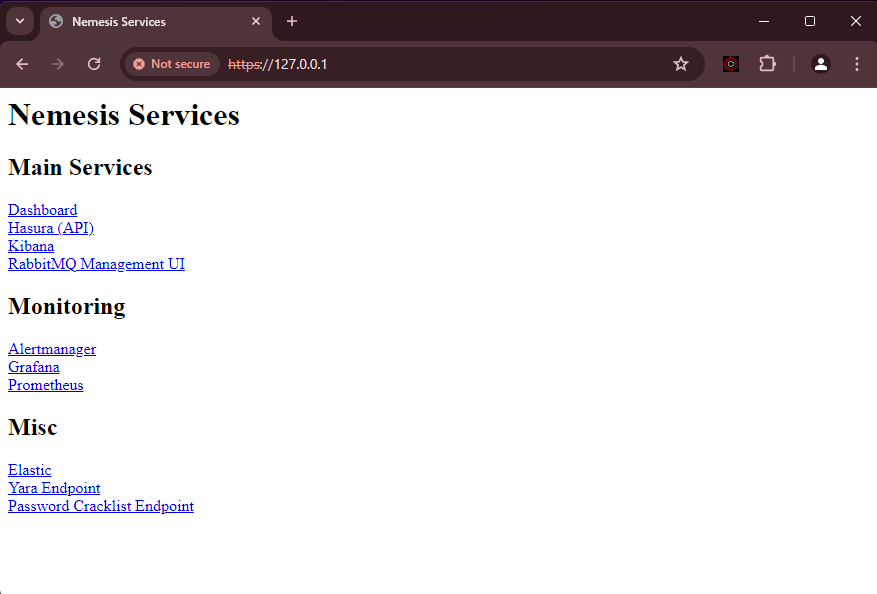

# Quickstart Guide

Here's a quickstart guide to setting up the Nemesis platform using k3s and Helm on Debian 11. This guide will start a Nemesis server listening on the server "192.168.1.10". Change this IP to the host that you will be accessing Nemesis from. If this does not fit your installation need, see the full [setup guide](setup.md). This process is automated in the [debian_k3s_setup.sh](https://github.com/SpecterOps/Nemesis/blob/main/debian_k3s_setup.sh) script, which accepts an IP as an argument.


### Prerequisites

Ensure your machine meets the following requirements:

- **OS**: Debian 11 LTS
- **Processors**: 4 cores (3 can work with adjustments)
- **Memory**: 16 GB RAM (minimum of 10 GB for reduced performance)
- **Disk Space**: 100 GB
- **Architecture**: x64 only

### Step 1: Install k3s

Execute the following commands to install [k3s](https://docs.k3s.io/quick-start):

```bash
curl -sfL https://get.k3s.io | sh -
mkdir -p ~/.kube && sudo k3s kubectl config view --raw > ~/.kube/config
chmod 600 ~/.kube/config
export KUBECONFIG=~/.kube/config
```


### Step 2: Install Helm

Install [Helm](https://helm.sh/docs/intro/install/):

```bash
curl https://baltocdn.com/helm/signing.asc | gpg --dearmor | sudo tee /usr/share/keyrings/helm.gpg > /dev/null
sudo apt-get install apt-transport-https --yes
echo "deb [arch=$(dpkg --print-architecture) signed-by=/usr/share/keyrings/helm.gpg] https://baltocdn.com/helm/stable/debian/ all main" | sudo tee /etc/apt/sources.list.d/helm-stable-debian.list
sudo apt-get update
sudo apt-get install helm
```


### Step 3: Install Dependencies

Install dependencies using Helm:

```bash
helm install elastic-operator eck-operator --repo https://helm.elastic.co --namespace elastic-system --create-namespace --set managedNamespaces='{default}'
```


### Step 4: Install the `quickstart` Chart

Deploy the `quickstart` Helm chart to configure secrets:

```bash
helm install --repo https://specterops.github.io/Nemesis/ nemesis-quickstart quickstart
```

### Step 5: Install `nemesis`

Deploy the main Nemesis services:

```bash
helm install --repo https://specterops.github.io/Nemesis/ nemesis nemesis --timeout '45m' --set operation.nemesisHttpServer="https://192.168.1.10:443/"
```

!!! tip

    Note that the nemesisHttpServer flag is being set to the accessible IP address of your server. If you are setting up Nemesis locally, you can remove the flag to set the variable. The default value for this flag is `https://127.0.0.1:443/`


### Step 6: Get basic-auth Secret

Retrieve the basic authentication credentials to access the dashboard:

```bash
export BASIC_AUTH_USER=$(kubectl get secret basic-auth -o jsonpath="{.data.username}" | base64 -d)
export BASIC_AUTH_PASSWORD=$(kubectl get secret basic-auth -o jsonpath="{.data.password}" | base64 -d)
echo "${BASIC_AUTH_USER}:${BASIC_AUTH_PASSWORD}"
```

### Step 7: Logging into the Dashboard

Once all installations and configurations are complete, open a web browser and go to: `https://192.168.1.10`

Enter the basic authentication credentials you retrieved earlier to access the Nemesis dashboard. Use the following credentials:

- **Username**: The value stored in `${BASIC_AUTH_USER}`
- **Password**: The value stored in `${BASIC_AUTH_PASSWORD}`

You should be greeted by the services page:




### Step 8: Upload File for Analysis

1. Navigate to the dashboard


2. Go to the "File Upload" page and upload a file for analysis

