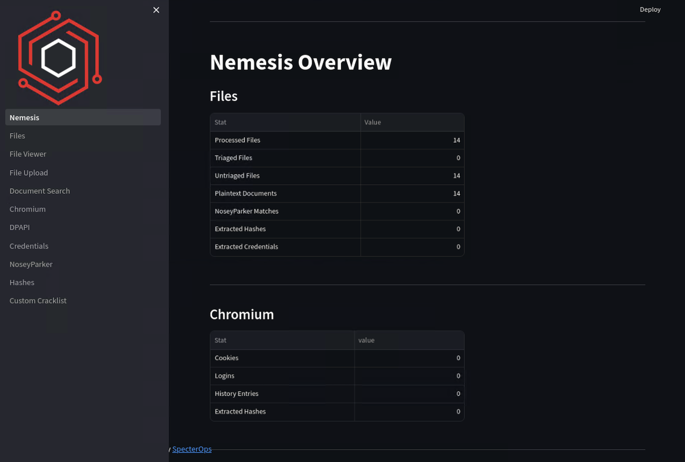
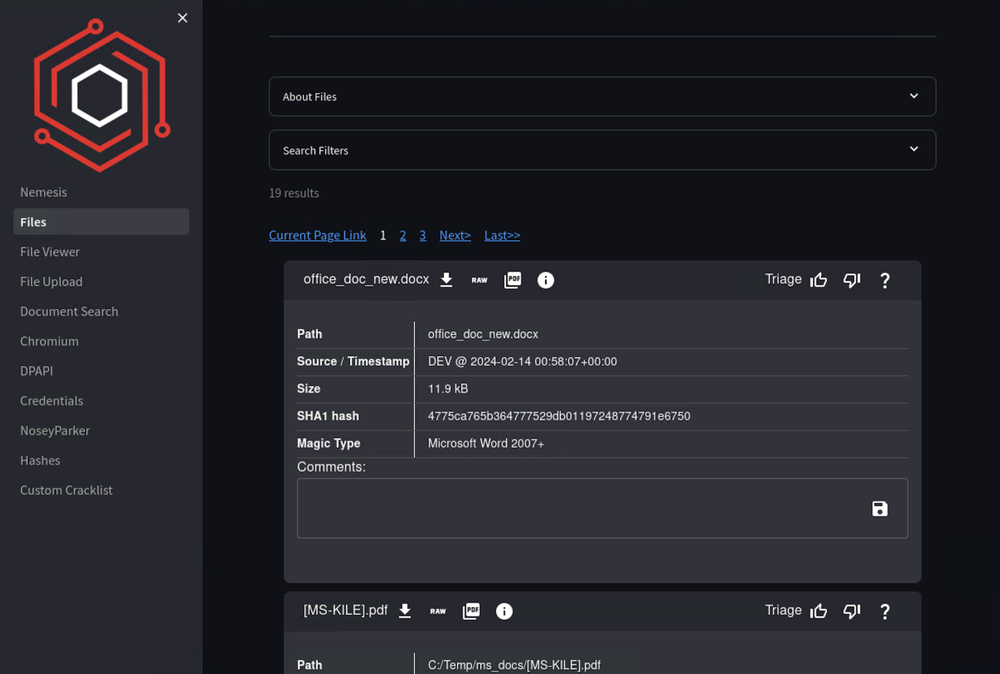

# Quickstart Guide

Here's a quickstart guide to setting up the Nemesis platform.

### Prerequisites

Ensure your machine meets the following requirements:

- **OS**: Linux (use Debian 12) or macOS
- **Processors**: 4 cores
- **Memory**: 12+ GB RAM
- **Disk Space**: 100 GB
- **Architecture**: x64 or Arm
- **Disk:** 80 GB

- **Docker/Docker-Compose:**
  - Docker version 28.0.0 or higher is recommended. See [Docker's installation instructions](https://docs.docker.com/engine/install/) for instructions on installing Docker. Running the Docker Engine on Linux or on OS X via Docker Desktop is recommended. If using Docker Desktop, ensure that the VM is configured with sufficient RAM/Disk/swap.


**NOTE:** for multi-language support for OCR/document processing, set the `TIKA_OCR_LANGUAGES` ENV var before launching with the [Tesseract language code](https://github.com/tesseract-ocr/tessdata):
```bash
$ export TIKA_OCR_LANGUAGES="eng chi_sim chi_tra jpn rus deu spa"
```


### Step 1: Clone the Nemesis Repository
```bash
git clone https://github.com/SpecterOps/Nemesis
cd Nemesis
```

### Step 2: Configuration
Create a `.env` file using the provided [env.example](https://github.com/SpecterOps/Nemesis/blob/main/env.example) as a template:
```bash
cp env.example .env
```
Then configure the values in the `.env` file with a text editor.

This file contains passwords and configuration that Nemesis uses. You should randomize these password values for your deployment!

**NOTE:** `NEMESIS_URL` is used to construct the appropriate absolute hyperlinks for findings and Apprise alerts. It does not affect the hosting of Nemesis itself. If using a hostname, a FQDN is preferred.

**NOTE:** for `APPRISE_URLs` to route user feedback to a specific channel use `?tag=feedback` as shown in the example .env file. Otherwise stock alerts will go to the first URL listed. See the [Alerting](./usage_guide.md#alerting) section of the Usage Guide for more information.

**NOTE:** To use your own SSL certificates, simply replace the `server.crt` and `server.key` files at `./infra/traefik/certs/` before launching Nemesis.


### Step 3: Start Nemesis
To start Nemesis's core services, run the `./tools/nemesis-ctl.sh` script:

```bash
./tools/nemesis-ctl.sh start prod
```

If you'd like to install the monitoring services and/or jupyter notebooks, use the associated optional command line arguments:

```bash
./tools/nemesis-ctl.sh start prod --monitoring --jupyter
```
`nemesis-ctl.sh` effectively is a wrapper for `docker compose` commands and is in charge of pulling and starting the appropriate published Nemesis docker images. In general, we recommend people use `nemesis-ctl.sh` instead of manually invoking `docker compose`. For more complex deployment scenarios, see Nemesis's [Docker Compose documentation](docker_compose.md) to understand what `nemesis-ctl.sh` does underneath.

### Step 4: Access the Web Dashboard

In a web browser, open `https://localhost:7443/` (or the URL Nemesis is hosted on) to access the main Nemesis web interface. Use `n:n` for basic auth unless you specified users. Upon logging in, you will enter your username and project (this is saved in your browser cache and only needed once):


If needed, you can change these values by clicking the **Settings** tab on the lower left:


After entering your information, you will then be shown the main Nemesis dashboard with processed file statistics and enrichment workflow information:



### Step 5: Upload File for Analysis

To manually upload files into Nemesis, click on the "File Upload" link in the sidebar. On this page you can upload one or more files into Nemesis:


After uploading the files, click on the "Files" link in the sidebar. Once Nemesis processes the files, they will appear in the table:



Click on the table row to to view the file's details:


See [Data Ingestion](./usage_guide.md#data-ingestion) for additional ways to ingest data into Nemesis besides manually uploading files through the web interface.

### Step 6: View Other Nemesis Services

Click on the "Help" button on the bottom left to view the additionally exposed Nemesis services. Each route listed is a hyperlink to the service. For logins, refer to the environment variables set.

**NOTE:** The monitoring services (Grafana, Jaeger, and Prometheus) will only be available if you started with them enabled (`--monitoring`).

**NOTE:** The /jupyter/ route will only be available if you started with it enabled (`--jupyter`).


### Step 7: Shutting Nemesis Down

To shutdown Nemesis, use the `nemesis-ctl.sh` script's `stop` or `clean` commands ***with the same arguments you used to start it***. For example, if you started it with monitoring and jupyter enabled, then run the following:
- To stop Nemesis containers:
```bash
./tools/nemesis-ctl.sh stop prod --monitoring --jupyter
```

- To stop Nemesis containers and delete their associated volumes:
```bash
./tools/nemesis-ctl.sh clean prod --monitoring --jupyter
```
