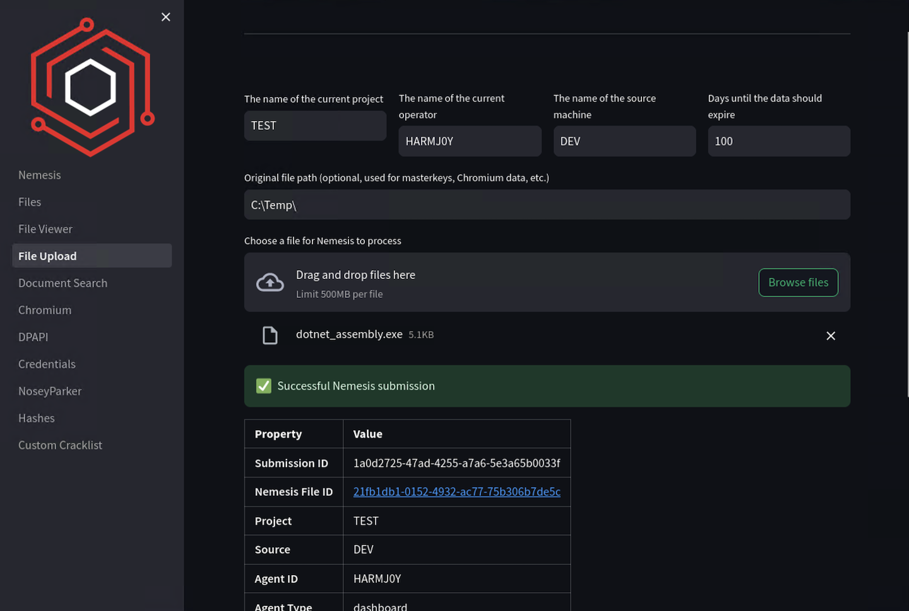

# Quickstart Guide

Here's a quickstart guide to setting up the Nemesis platform.

### Prerequisites

Ensure your machine meets the following requirements:

- **OS**: Windows, Linux, or macOS
- **Processors**: 4 cores (3 can work with adjustments)
- **Memory**: 8 GB RAM (12+ GB recommended)
- **Disk Space**: 100 GB
- **Architecture**: x64 or Arm

### Step 1: Install Docker/Docker-Compose

We recommend [Docker Desktop](https://www.docker.com/products/docker-desktop/) with the following minimum resources:

**Memory limit:** 8 GB
**Swap:** 2 GB
**Virtual Disk:** 80 GB


### Step 2: Export necessary environment variables (required)

```bash
export NEMESIS_URL=https://localhost:7443/
export GRAFANA_ADMIN_PASSWORD=Qwerty12345
export GRAFANA_ADMIN_USER=nemesis
export JUPYTER_PASSWORD=Qwerty12345
export MINIO_ROOT_PASSWORD=Qwerty12345
export MINIO_ROOT_USER=nemesis
export POSTGRES_PASSWORD=Qwerty12345
export POSTGRES_USER=nemesis
export RABBITMQ_PASSWORD=Qwerty12345
export RABBITMQ_USER=nemesis

# Optional
export APPRISE_URLS=slack://Nemesis@T...6x/#nemesis-testing,slack://Nemesis@T...k/#nemesis-feedback?tag=feedback
```

**NOTE:** you should randomize these password values for production deployments!

**NOTE:** `NEMESIS_URL` _is used to construct the appropriate absolute hyperlinks for findings and Apprise alerts. It does not affect the hosting of Nemesis itself._

**NOTE:** for APPRISE_URLs, to route user feedback to a specific channel use `?tag=feedback` as shown above. Otherwise stock alerts will go to the first URL listed. See the [Alerting](./usage_guide.md#alerting) section of the Usage Guide for more information.

#### Changing the Nemesis Port

To change the port that Nemesis is hosted on, set a new port with `export NEMESIS_PORT=1234` before running Nemesis ensure the `NEMESIS_URL` ENV variable reflects the correct port.

#### Using Other SSL Certficiates

To use your own SSL certificates, simply replace the `server.crt` and `server.key` files at ../infra/traefik/certs/ before launching Nemesis.


### Step 3: Build and start Nemesis.

#### For Development Deployments

This will build all of the images instead of pulling the prebuilt images.

```bash
export ENVIRONMENT=dev

# build the base images
docker compose -f docker-compose.base.yml build

# build/stand up everything
docker compose up
```

Alternatively, you can use the `./tools/start.sh` script which automates all of this:

```bash
./tools/start.sh dev
```

#### For Production Deployments

For prod deployments or instructions on how to add users for basic auth, run `./tools/generate_start_command.sh`:

```bash
% ./tools/generate_start_command.sh

To start Nemesis, run the following:

    # No users specified. Default user & pass are both the letter 'n')
    export ENVIRONMENT=prod
    docker compose -f docker-compose.base.yml build
    docker compose -f docker-compose.yml -f docker-compose.prod.yml pull
    docker compose -f docker-compose.yml -f docker-compose.prod.yml up


To add users, set the USERS (comma-separated) and PASSWORD environment variables and re-run this script.
Note: All users will share the same password.
Example:

    USERS='alice,bob,carol' PASSWORD='password' ./tools/generate_start_command.sh
```

***Note: In production mode, the "latest" tagged containers will eventually be pulled (but are not currently)!***

### Step 4: Logging into the Dashboard

Open up `https://localhost:7443/` (or the URL Nemesis is hosted on) for the main Nemesis interface. Use `n:n` for basic auth unless you specified users via the `./tools/generate_start_command.sh` command. You will then need to enter your username and project name which are saved in your browser cache:


This can be changed by clicking the "Settings" tab on the lower left:


After entering your information, you will then be shown the main Nemesis dashboard with processed file statistics and enrichment workflow information:


### Step 5: Upload File for Analysis

To manually upload a file into Nemesis, click on the "File Upload" link in the sidebar:



Then view the file after analysis (click on the file entry for more details):


See [Data Ingestion](./usage_guide.md#data-ingestion) for additional ways to ingest data into Nemesis besides manually uploading files through the web interface.

### Step 6: View Other Nemesis Services

Click on the "Help" button on the bottom left to view the additionally exposed Nemesis services. Each route listed is a hyperlink to the service. For logins, refer to the environment variables set.


### Step 7: Shutting Nemesis Down

If you used `docker compose up` without `-d`, just ctrl + c to bring Nemesis down. To wipe the data stores for a fresh start, after bringing it down run `docker compose down -v`.
