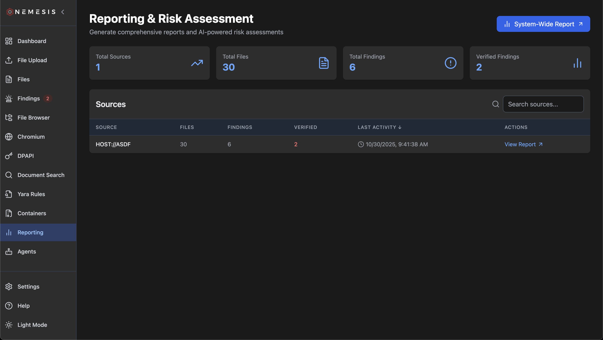
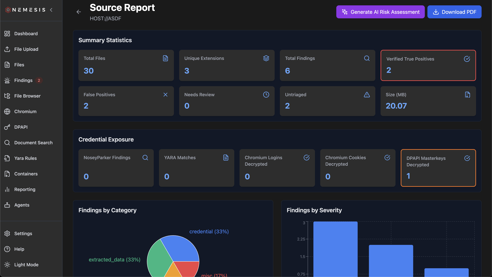
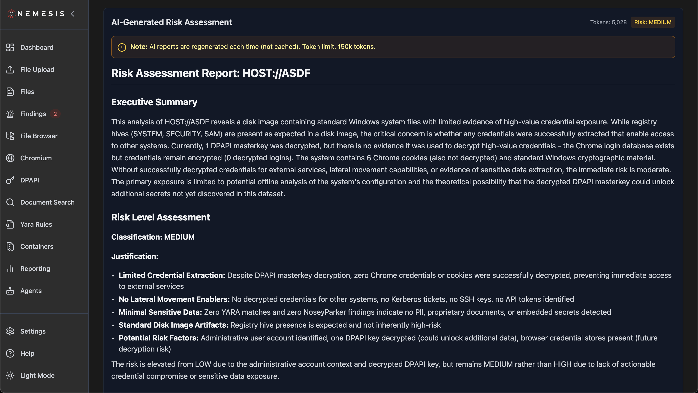

# Reporting

The **Reporting** page on the left navigation bar will lead you to the main Nemesis reporting interface:

This gives some basic statistical information and the list of unique hosts (`source`'s) currently in the Nemesis datastore. Clicking "System-Wide Report" will take you to summary report for *all* processed data, while clicking an individual source's "View Report" link will take you to a source's individual pagae:

Clicking the "Download PDF" button in the top right will generate the report as a PDF, while clicking the "Generate AI Risk Assessment" will, assuming [LLM Agents](./agents.md) functionality is enabled, use the **Report Generator** agent to synthesize a risk report based on findings and data for that host/source:

Note that this agent is still a work in progress and we hope to continue to improve it!