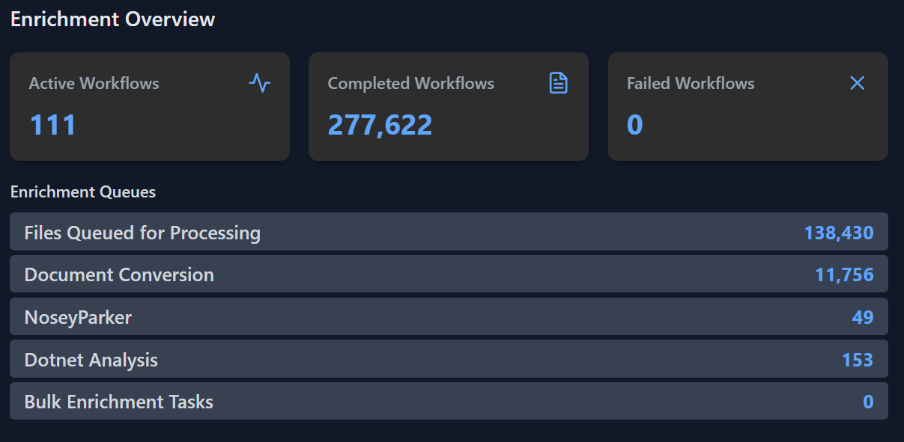
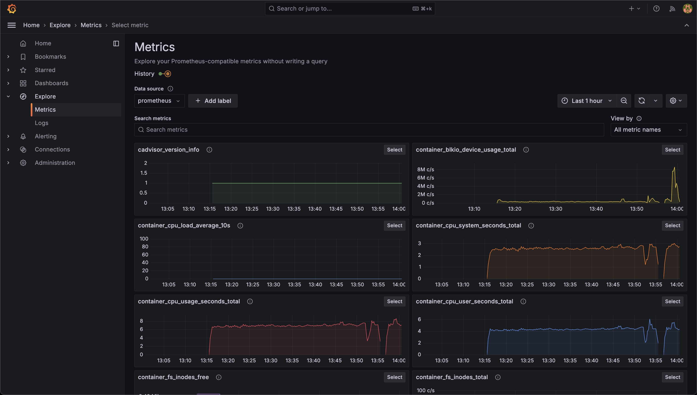
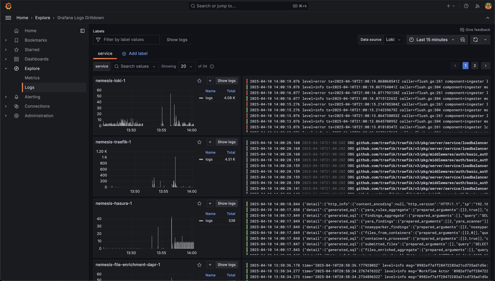
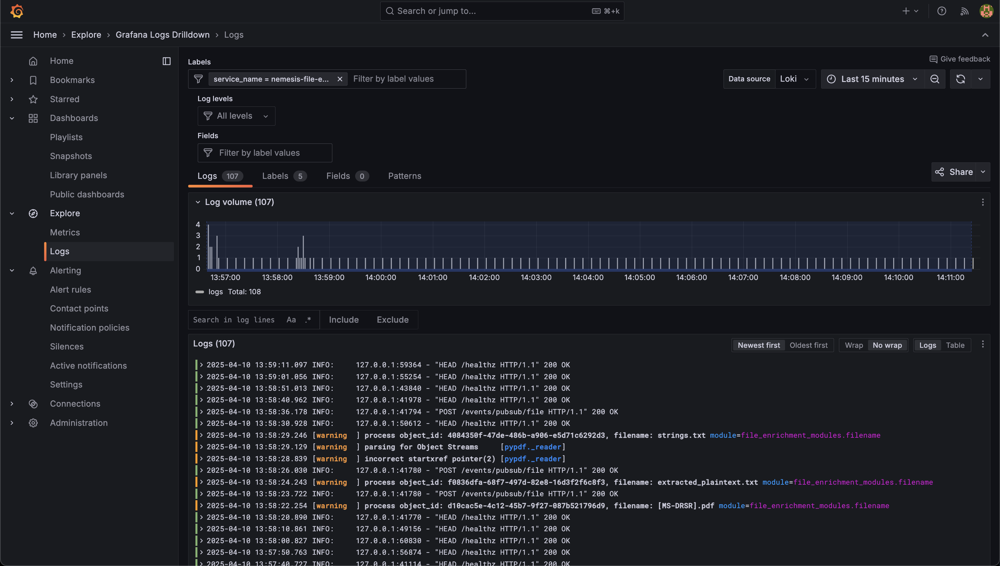
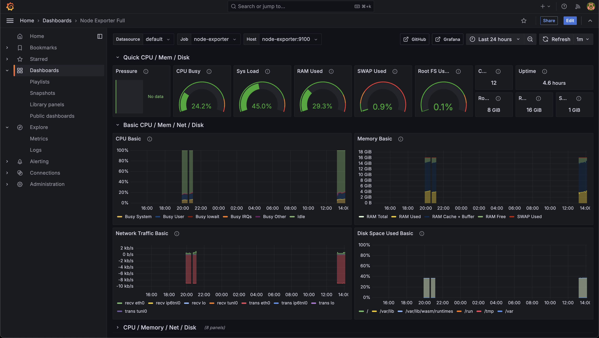
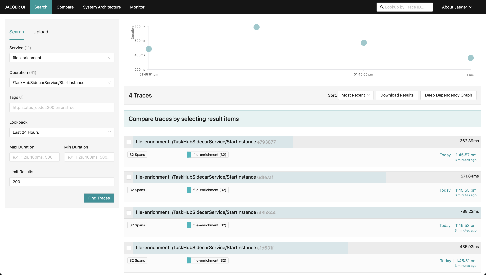
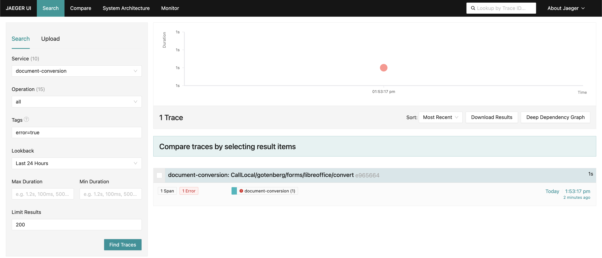
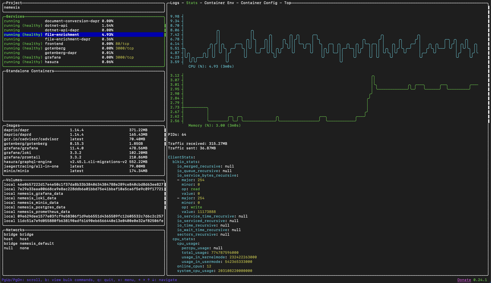

# Troubleshooting

Nemesis has a number of services to help with assist with troubleshooting.

**Note** that Grafana + Jaeger tracing are only available if you use the `--monitoring` flag when launching Nemesis!

## Analyze Message Queues

Nemesis uses message queue in its enrichment workflows. To quickly get an overview of the state of the queues, view the "Enrichment Queues" section in Nemesis's dashboard:

  view the You can view the state of all the queues by navigating to the **Help** menu reachable in the bottom left of the Nemesis interface and clicking the `/rabbitmq/` route link will take you to the RabbitMQ interface. This interface can be used to track message counts, delivery rates, etc. Clicking on "Queues and Streams" will allow you to view the state of the queues, including how many items are waiting to be processed (in the "Ready" column) and the rate at which Nemesis processing the queues:

If the queues are backed up, you have three options : 

1. Do nothing and just wait until Nemesis completes processing the queues. You can get a rough idea how long it will take to process by looking the `deliver / get` rates in the RabbitMQ interface's "Queues and Streams" page.
2. Monitor Nemesis's performance and adjust its settings to your system and workloads (see [Nemesis Performance Tuning](./performance.md)).
3. Purge the queues to stop processing. You can purge the queue by clicking on the queue name in the RabbitMQ dashboard (e.g. `files-new_file` for newly added files) and clicking the "Purge Queue" button.

## Grafana

Navigating to the **Help** menu reachable in the bottom left of the Nemesis interface and clicking the `/grafana/` route link will take you to the Grafana interface. Clicking the **Metrics** Grafana link on the Help page will take you to the general metrics visualization:

Clicking the **Logs** Grafana link on the Help page will take you to the general logs Loki idexing in Grafana:

Filtering by a specific service name will allow you to drill down into the logging for that service, which can easily be searched, for example with the `nemesis-file-enrichment` service:

Clicking the dashboards link in Grafana will bring you to a few preconfigured dashboards as well:

## Jaeger Tracing

Navigating to the **Help** menu reachable in the bottom left of the Nemesis interface and clicking the `/jaeger/` route link will take you to the Jaeger tracing interface. Reaching Jaeger via this link will filter for the `file-enrichment: /TaskHubSidecarService/StartInstance` trace type by default (the Dapr file_enrichment workflow trace):

Clicking a trace will give you more information on the trace:

This can help track down locations for slowdown or other failures- for example by filtering across services for `error=true`:

## Lazydocker

While [Lazydocker](https://github.com/jesseduffield/lazydocker) is not a Nemesis specific project, we highly recommend it for general troubleshooting when using Docker containers:

Note: the CPU usage displayed in lazydocker is the CPU used by the container across all cores. So if there's 10 cores and a container is using 100% of a single core, then it'll display as 10%.