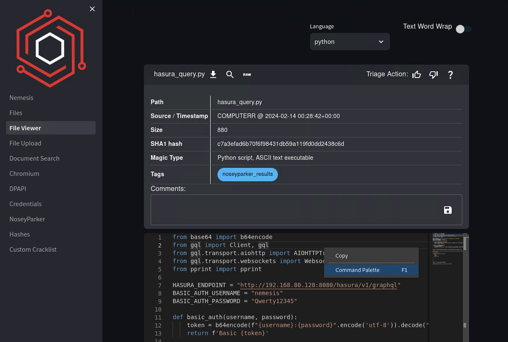
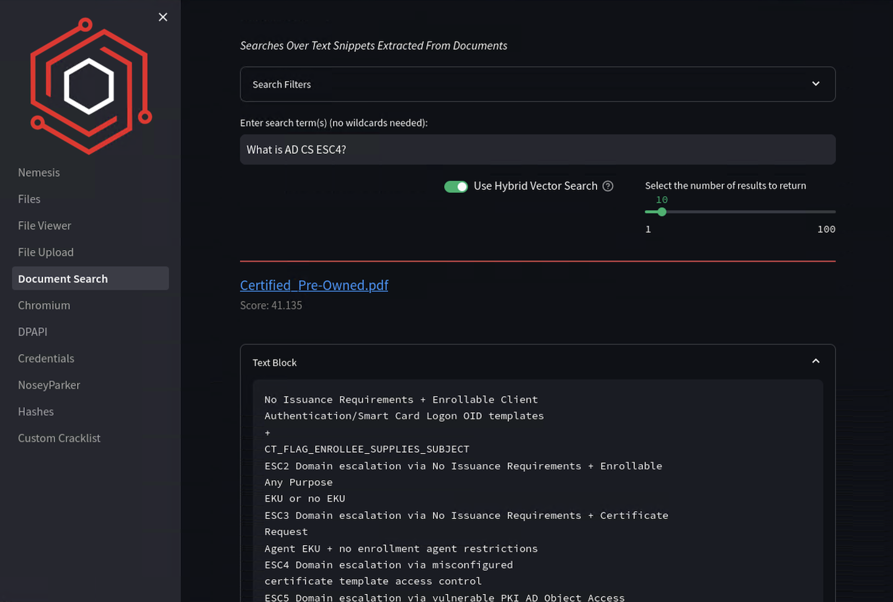
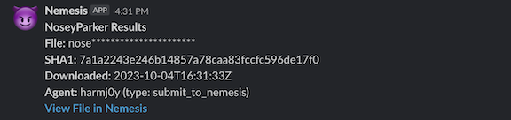

# Nemesis Usage Guide

This page covers usage of Nemesis after the system is properly [setup](setup.md).

For a general overview of the Nemesis project structure, see [overview.md](overview.md)

- [Nemesis Usage Guide](#nemesis-usage-guide)
- [Data Ingestion](#data-ingestion)
  - [Nemesis C2 Connector Setup](#nemesis-c2-connector-setup)
- [Nemesis Dashboard](#nemesis-dashboard)
  - [Files](#files)
    - [File Triage](#file-triage)
  - [File Details](#file-details)
  - [Manual File Upload](#manual-file-upload)
  - [Document Search](#document-search)
    - [Full Document Search](#full-document-search)
      - [Source Code Search](#source-code-search)
    - [Snippet Search](#snippet-search)
    - [Search Filtering](#search-filtering)
- [Alerting](#alerting)
- [Elasticsearch/Kibana](#elasticsearchkibana)

# Data Ingestion

Once Nemesis is running, data first needs to be ingested into the platform. Ingestion into Nemesis can occur in muliple ways, including:
* [Auto-ingesting data from C2 platorms.](#nemesis-c2-connector-setup)
* [Manually uploading files on the "File Upload" page in the Nemesis's Dashboard UI.](#manual-file-upload)
* Using the [submit_to_nemesis](submit_to_nemesis.md) CLI tool to submit files.
* Writing custom tools to interact with [Nemesis's API](new_connector.md).

## Nemesis C2 Connector Setup
Nemesis includes connectors for various C2 platorms. The connectors hook into the C2 platforms and transfer data automatically into Nemesis. The `./cmd/connectors/` folder contains the following C2 connectors:

- [Cobalt Strike](https://github.com/SpecterOps/Nemesis/tree/main/cmd/connectors/cobaltstrike-nemesis-connector#readme)
- [Mythic](https://github.com/SpecterOps/Nemesis/tree/main/cmd/connectors/mythic-connector#readme)
- [Sliver](https://github.com/SpecterOps/Nemesis/tree/main/cmd/connectors/sliver-connector#readme)
- [OST Stage1](https://github.com/SpecterOps/Nemesis/tree/main/cmd/connectors/stage1-connector#readme)
- [Metasploit](https://github.com/SpecterOps/Nemesis/tree/main/cmd/connectors/metasploit-connector#readme)
- [Chrome Extension](https://github.com/SpecterOps/Nemesis/tree/main/cmd/connectors/chrome-extension#readme)

***Note: not all connectors have the same level of completeness! We intended to show the range of connectors possible, but there is not yet feature parity.***

# Nemesis Dashboard

The main method for operators/analysts to interact with Nemesis data is through the Nemesis Dashboard. The dashboard can be accessed at `http://NEMESIS_IP:8080/dashboard/`. The initial display shows details about the number of processed files:

## Files

One of the common tasks for the dashboard is file triage, accessible through the `Files` page on the left navigation bar:

As files are processed by Nemesis, they will appear as paginated card entries on this page. By default the files will be sorted newest to oldest, but this can be modified in the dropdown "Filters", which also includes other filtering options:

For each file entry, the file path, download timestamp, size (in bytes), SHA1 hash, and magic type for the file are displayed. Additionally, any applicable pre-defined tags, such as `noseyparker_results`, `contains_dpapi`, `encrypted`, etc. will be displayed. These tags can be filtered for as well:

The top icons by each file will let you download a file, view the raw file bytes in a new browser tab, optionally view a PDF of the file (if applicable) in a new browser tab, download the decompiled .NET source code for an assembly (if applicable), and view the [File Details](#file-details) for the file.

### File Triage

At the top right of each file card, there is a **Triage** section with 👍 , 👎, and ❓ icons. These icons correspond to "Interesting", "Not Interesting", and "Unknown", respectively. When an icon is clicked, the triage value for the file is stored in the Nemesis backend and the file card is hidden (hidden cards can be reshown via the search filters). The selected icon will be reflected in the [File Details](#file-details) page for the file. This default behavior allows for multiple operators/analysts to easily triage large numbers of files without duplicated effort.

Additionally, comments can be saved for the file, which are also persistently saved in the Nemesis backend:

## File Details

The **File Details** page for an individual file will display the same file card (containing path/timestamp/size/SHA1/magic type/tags/comments, triage icons, and comments) as [Files](#files) page. Beneath the card the bytes of the file (or plaintext if not binary) are displayed in a [Monaco editor](https://microsoft.github.io/monaco-editor/), a Visual Studio Code-light component that contains appropriate syntax highlighting and VSCode shortcuts.

Each file also has an **Elasticsearch Info** tab at the top, which shows the full JSON-formatted information dump of the file's storage in Elasticsearch (you can obviously find this in the `http://<NEMESIS_SERVER>/kibana/` endpoint as well):

If the file has any [Nosey Parker](https://github.com/praetorian-inc/noseyparker) results, a **Noseyparker Results** tab will appear. This tab will display each triggered rule, the matched content, and the context for the content as well:

Likewise, if there are any Yara matches, a **Yara Matches** tab will appear. This tab will display each triggered rule, the matched content, and the matching Yara rule definition:

## Manual File Upload

Files can be manually uploaded through the Nemesis dashboard via the `File Upload` tab on the left navigation bar. After navigating to the page, information such as the operator ID, ..., needs to be completed. This information is saved via browser cookies and does not need to be entered every time. The "Original File Path" is optional but recommended. Files can be dragged/dropped into the upload modal, and on successful submission Nemesis will display the following message:

The file will then be displayed in the [Files](#files) page as soon as it's done processing.

## Document Search

Nemesis will extract plaintext from any files that can have ASCII/Unicode text extracted and indexes the text into the Elasticsearch backend. The **Document Search** page on the left navigation bar allows operators/analysts to search through any indexed text. Search can accomplished via **Full Document Search** and **Snippet Search**.

### Full Document Search

The default search will match the supplied search term(s) in indexed plaintext documents, displaying paginated searches along with some details about the orignating document:

#### Source Code Search

The **Source Code Search** tab on the top of the page functions similarly to the raw text search, but only searches indexed source code documents, as opposed to "regular" plaintext documents. To search source code, change the search index in the dropdown search filters to `source_code`:

### Snippet Search

The **Snippet Search** tab operates a bit differently. In addition to being normally indexed in Elasticsearch, all text extracted from plaintext documents by Nemesis are also broken into chunks and run through a small [embedding model](https://www.elastic.co/what-is/vector-embedding) to produce fixed-length vector embeddings. The model currently being used is [gte-tiny](https://huggingface.co/TaylorAI/gte-tiny) but this can be modified in the [nlp.yaml](https://github.com/SpecterOps/Nemesis/blob/main/helm/nemesis/templates/nlp.yaml) of the NLP container. These embeddings are stored in Elasticsearch along with the associated chunked text, allowing for [sematic search](https://en.wikipedia.org/wiki/Semantic_search) over indexed text.

In addition, we also exploit the BM25 text search of Elasticsearch over the sparse indexed text. The two lists of results are fused with [Reciprocal Rank Fusion (RRF)](https://learn.microsoft.com/en-us/azure/search/hybrid-search-ranking) and the reordered list of snippets is presented to the user:

If you want to _only_ use the more traditional/fuzzy BM25 search and now the vector embeddings, de-select "Use Hybrid Vector Search".

See [this Twitter thread for more background on this approach](https://x.com/harmj0y/status/1757511877255471299).

### Search Filtering

Both "Full Document Search" and "Snippet Search" allow for file paths/patterns to include or exclude in searches. These can be wildcard paths or extensions, and multiple `|` delineated terms can be specified.

For example, to search files _only_ from a specific directory:

To exclude .pdfs from searching:

# Alerting

If Slack alerting is enabled, alerts on "interesting" files (e.g., parsed credentials, Nosey Parker hits, DPAPI data discovery, etc.) will be pushed to the configuered Slack webhook/channel with **Nemesis** as the bot user. These messages will contain the alert name, sanitized file name, file SHA1, download timestamp, agent ID, message details, and a link to the [file details](#file-details) in the dashboard:

# Elasticsearch/Kibana

Navigating to `http://NEMESIS_IP:8080/kibana/` will lead to the main Kibana dashboard for all indexed data (creds are set in `nemesis.config`)

The top left will display the stored indexes. The most interesting indexes for operators/analysts will likely be `file_data_enriched`. Standard Kibana searches can be done across any indexed data.

Additionally, for Nemesis troubleshooting, Fluentd logs are stored in the `fluentd-*` indices and searchable.

