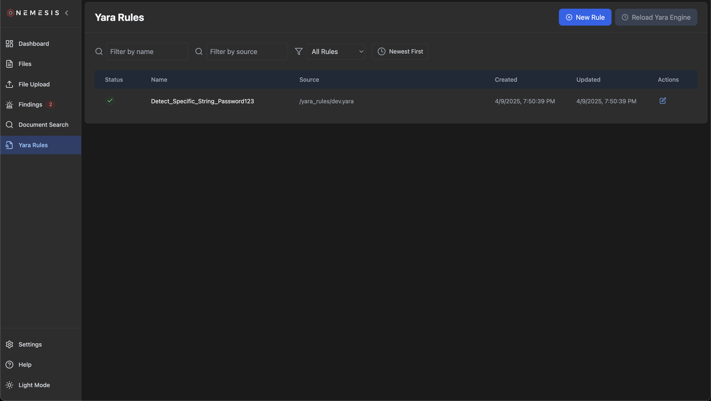
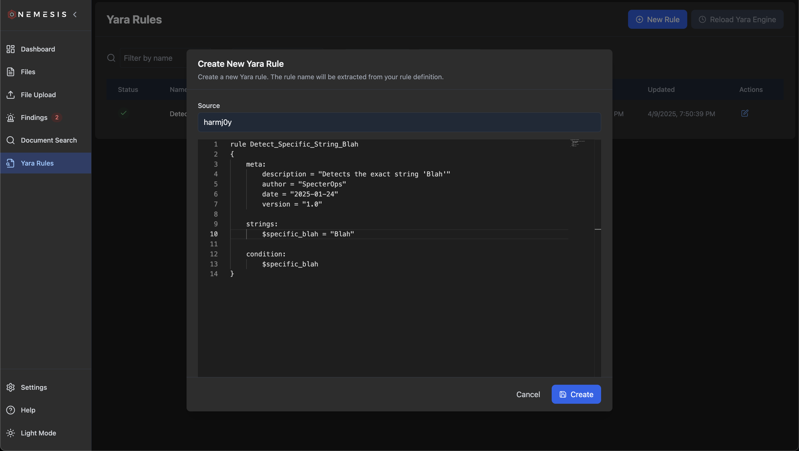
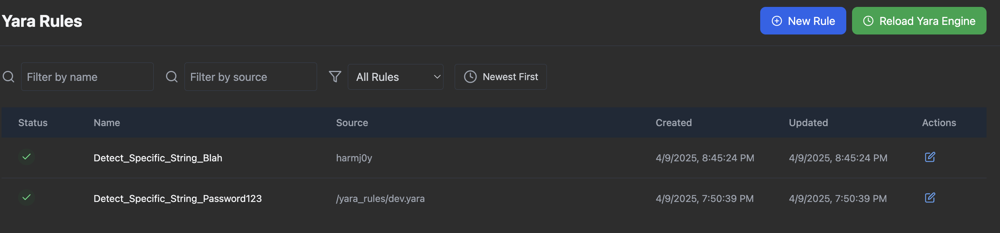
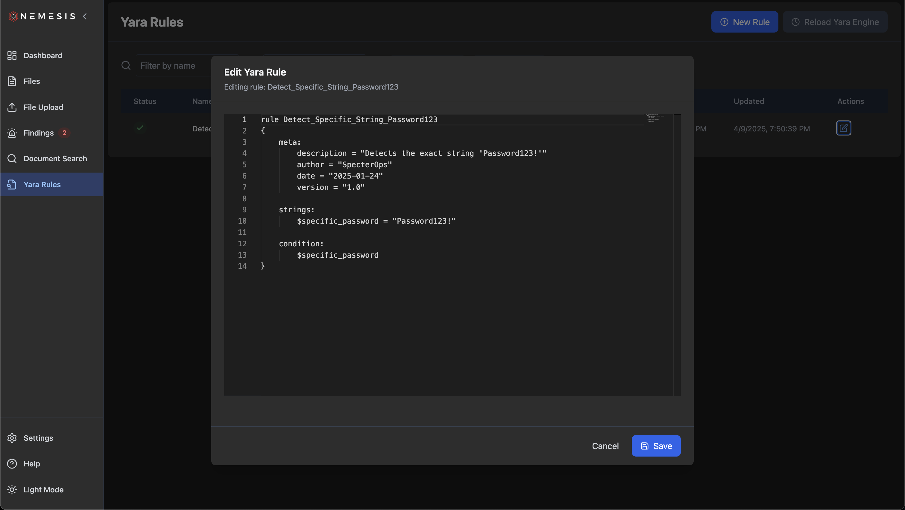
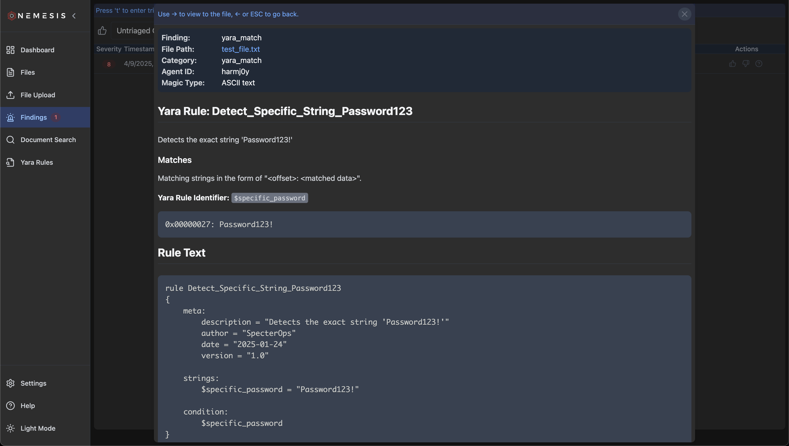

## Yara

Nemesis has the ability to dynamically edit existing, and deploy new, Yara rules which are run against all files (including plaintext extracted from applicable files). These rules are stored in the PostgreSQL backend and [dynamically loaded](https://github.com/SpecterOps/Nemesis/tree/main/libs/file_enrichment_modules/file_enrichment_modules/yara/yara_manager.py) by the Yara file enrichment module uses [yara-x](https://github.com/VirusTotal/yara-x) for performant scanning.

Clicking on "Yara Rules" tab on the left will bring you to the main Yara rules page. In development mode, a single test rule will be present; in production mode a number of existing rules will be loaded:

### Adding New Rules

Click the "New Rule" button on the top to draft a new Yara rule and click "Create". The rule name will be extracted from the definition:

After rule creation, click the (now) green "Reload Yara Engine" button to ensure the Yara backend is reloaded with the new rule states. The rules will be saved in the database and reload if the entire system is brought down and up again.

### Adding New Default Rules

If you want to change the default set of rules _without_ having to add rules on each deployment, add a new yara file to `./libs/file_enrichment_modules/yara_rules/dev/` for development or `./libs/file_enrichment_modules/yara_rules/prod/` for production.

### Editing Existing Rules

To edit an existing rule, click the "Edit Rule" button under actions, modify the rule as wanted, and click "Save":

Like when adding a new rule, ensure you click the (now) green "Reload Yara Engine" button to ensure the Yara backend is reloaded with the new rule states.

### Rule Alerts

Alerts for any matching rules will be shows in the [Findings](findings.md) tab. This will include the data match as well as the rule details:

