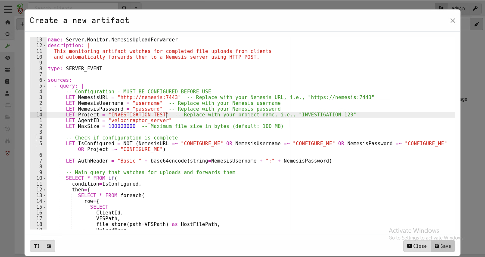
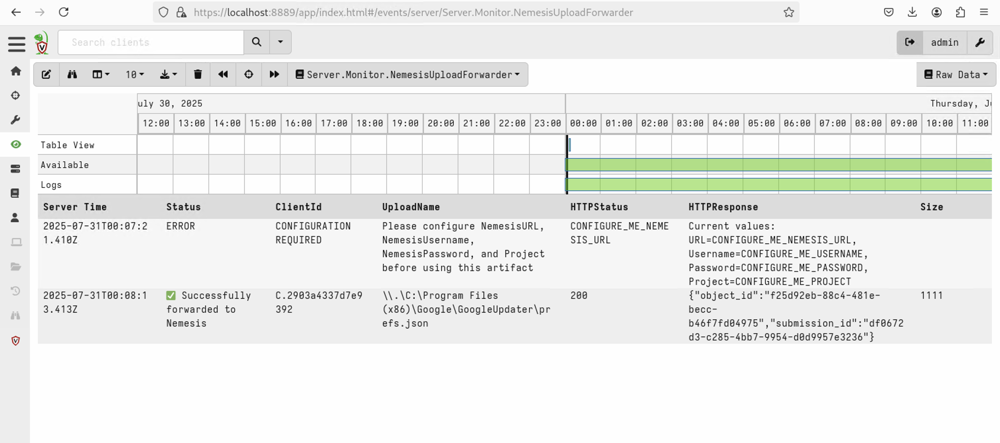

# Velociraptor Nemesis Connector

## Velociraptor Server Event Script

The `velociraptor_server_nemesis_connector.yaml` script can be [installed as a Velociraptor Server Artifact](https://docs.velociraptor.app/docs/server_automation/server_monitoring/).

### Installation

Simply replace the following variables at the top of the Yaml file:
- **NemesisURL** - Your Nemesis URL, reachable from the Velociraptor server (i.e., https://nemesis:7443)
- **NemesisUsername** - Your Nemesis username
- **NemesisPassword** - Your Nemesis password
- **Project** - i.e., "INVESTIGATION-123"
- **MaxSize** - optional, maximum file size (in bytes), default of 100MB

Then Click "View Artifacts" on the left of the Velociraptor GUI, click the + to "Add an Artifact" and paste the Yaml in:

Then click "Server Events" on the left, click "Select Artifact" and select **Server.Monitor.NemesisUploadForwarder**. Details on files synchronized to Nemesis will be displayed, along with an error message if the configuration was not performed correctly.

